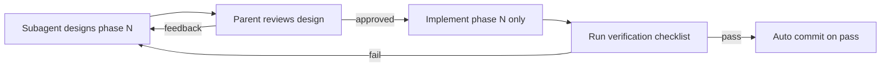
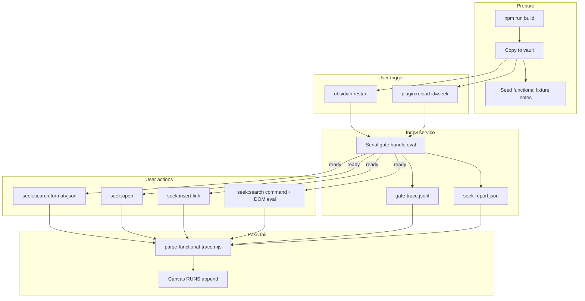
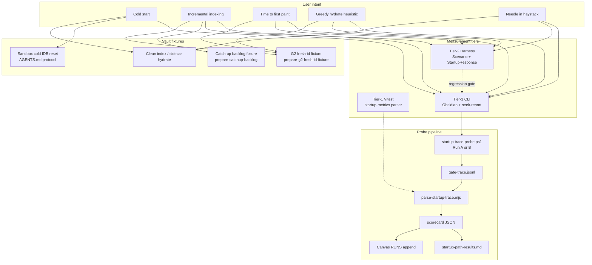
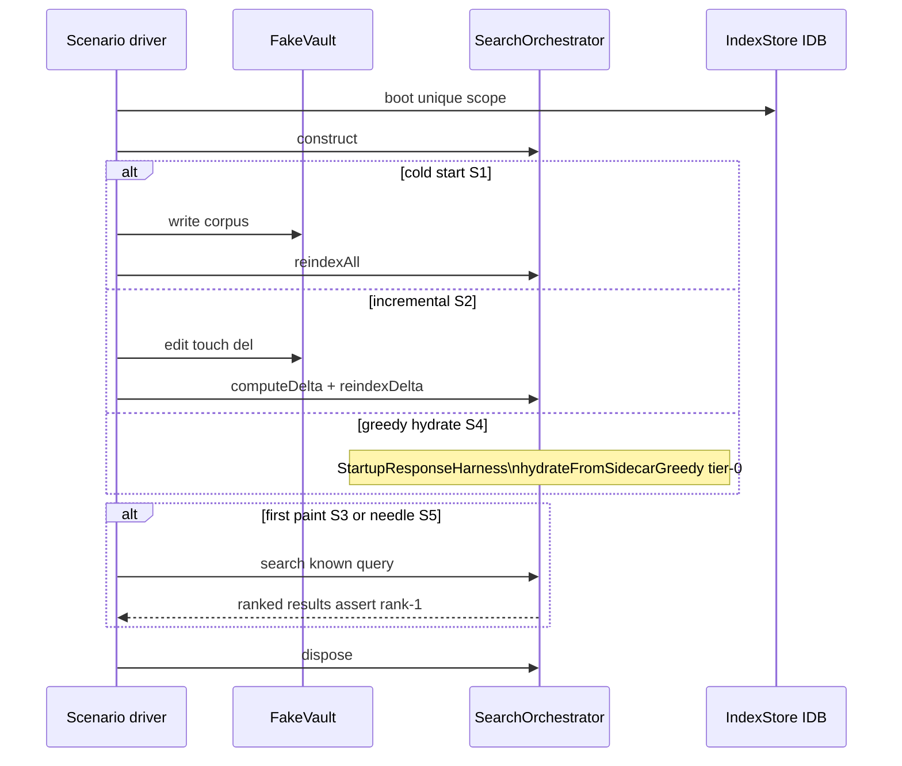

# Telemetry playbook and canvas reset

## Phased delivery, commits, and review loop

All work happens on **`test/telemetry-playbook-baselines`** (created from `main` before Phase 0). Work ships in **6 phases**. Each phase follows the same gate — no phase starts until the prior phase is verified and committed (repo phases) or handoff-recorded (Phase 1 canvas).

### Git branch (once, before Phase 0)

| Step | Command / rule |
|------|----------------|
| Branch | `git checkout main` → `git pull` (if needed) → `git checkout -b test/telemetry-playbook-baselines` |
| Stay on branch | Every repo commit through Phase 6 lands here — **do not commit to `main`** |
| Push | Push branch after each phase commit (or batch push at end — prefer **after each phase** so history is recoverable) |
| Merge | Open PR to `main` only when user asks; do not merge without approval |

### Per-phase workflow (subagent → parent)



| Step | Owner | Output |
|------|-------|--------|
| 1. Design | **Subagent** | Phase brief: scope, files, out-of-scope, verification commands, draft commit message |
| 2. Review | **Parent** | Approve, or send feedback (scope creep, missing verify, wrong vault) |
| 3. Implement | **Subagent** | Only files in approved scope — no next-phase work |
| 4. Verify | **Subagent runs**, **Parent reads** | Phase checklist must pass — no commit if any item fails |
| 5. Commit | **Subagent** (automatic on pass) | One conventional commit per verified repo phase; push to `test/telemetry-playbook-baselines` |

**Commit rules:**
- **Auto-commit when verify passes** — no waiting for a separate commit request per phase
- **One commit per verified phase** — do not batch phases
- **Repo only** — canvas lives in `~/.cursor/projects/.../canvases/` (not git); skills/fixtures/tests in repo
- **Never commit** — `.cursor/telemetry-screenshots/`, `.cursor/functional-traces/`, `fixtures/generated/query-candidates.json`
- **Do commit** — fixture JSON after baseline capture (expected blocks are stable test data)
- **No CHANGELOG** — internal agent/tooling (per existing plan)
- **Conventional commits** — `feat(telemetry): …`, `test(telemetry): …`, `docs(telemetry): …`
- **Commit hygiene** — stage only phase-scoped files; run `git status` after commit to confirm clean tree (except intentional WIP)

---

### Phase 0 — Infra stub

| | |
|--|--|
| **Design deliverable** | File list: `.gitignore` entries, empty `src/test-harness/functional-telemetry/` README |
| **Implement** | Gitignore paths; harness folder placeholder |
| **Verify** | `git status` shows only intended files; `npm test` still green (no new tests yet) |
| **Commit** | `chore(telemetry): gitignore functional trace dirs and add harness placeholder` |

---

### Phase 1 — Canvas scaffold

| | |
|--|--|
| **Design deliverable** | Canvas component list: S1–S7 + F1–F10 nav, empty `RUNS`, p50/p95 helpers, timeline chart (hidden when n=0), screenshot path refs |
| **Implement** | [`sandbox-run-history.canvas.tsx`](C:\Users\tilou\.cursor\projects\c-Coding-projects-Obsidian-Seek\canvases\sandbox-run-history.canvas.tsx) — retitle, clear runs, no hardcoded Run 1–3 |
| **Verify** | Open canvas in Cursor: overview loads; 17 scenario rows pending; no runtime/chart errors; "Adding future runs" schema visible |
| **Commit** | _None_ (canvas outside repo) — write handoff JSON with `verified: true`, `commit: null`; proceed to Phase 2 |

---

### Phase 2 — Playbook catalog skeleton

| | |
|--|--|
| **Design deliverable** | `seek-playbook-catalog/SKILL.md` outline; `playbook-scenarios.json` with all 17 ids (`status: stub` where no driver); `list-scenarios.ps1`; `run-scenario.ps1` router that errors clearly on stub |
| **Implement** | Catalog skill + scripts + empty `scripts/drivers/` |
| **Verify** | `list-scenarios.ps1` prints 17 rows with id, driver, mode; `run-scenario.ps1 -Id F3` fails with "driver stub" not silent pass |
| **Commit** | `feat(telemetry): add seek-playbook-catalog with scenario registry and list command` |

---

### Phase 3 — Fixture schema + CI validation

| | |
|--|--|
| **Design deliverable** | `QueryCase` / `QueryIntent` types; `functional-queries.json` **shape** with 3 placeholder cases; `validate-fixture.test.ts` rules (3 per intent, 30 unique queries when full file lands) |
| **Implement** | Types, minimal placeholder JSON, Vitest validator (may skip full 30 until Phase 4) |
| **Verify** | `npm run typecheck`; `npm test -- validate-fixture` passes on placeholder; fails if duplicate query injected |
| **Commit** | `test(telemetry): add functional fixture schema and validation tests` |

---

### Phase 4 — Vault-polled query matrix (30 distinct)

| | |
|--|--|
| **Design deliverable** | `sample-vault-queries.ps1` algorithm; `capture-query-baseline.ps1`; distinctness rules; which vault (sandbox vs minimal) |
| **Implement** | Poll sandbox → assign 30 queries → capture expected via CLI → `minimal/` and/or `full/` JSON committed |
| **Verify** | `validate-fixture.test.ts` passes (30 cases, 3×10 intents, unique queries); spot-check 3 cases: `seek:search format=json` matches `expected.rank1Path` |
| **Commit** | `feat(telemetry): add vault-polled functional query fixtures with baselines` |

---

### Phase 5 — MVP drivers + detail playbooks

| | |
|--|--|
| **Design deliverable** | Driver specs for S1, F2, F3, S6; lib helpers (`Invoke-ObsidianCli.ps1`, `Emit-CanvasRunJson.ps1`); telemetry + functional SKILL stubs |
| **Implement** | Working drivers wrapping existing `startup-trace-probe.ps1` where applicable; F3 loops query cases |
| **Verify** | Deploy seek to vault; `run-scenario.ps1 -Id F3 -FixtureSet minimal -AllQueryCases` exit 0; `run-scenario.ps1 -Id S1 -Run A` produces JSONL; `npm test` green |
| **Commit** | `feat(telemetry): add MVP scenario drivers and playbook detail skills` |

---

### Phase 6 — Remaining drivers + docs

| | |
|--|--|
| **Design deliverable** | Stub vs full matrix for F4–F8, F9 (screenshot), F10; AGENTS.md + cross-links |
| **Implement** | Stubs with honest `status: stub`; F6/F9 screenshot path in trace; docs |
| **Verify** | `list-scenarios.ps1` shows stub/full accurately; F9 stub writes gitignored PNG path reference; AGENTS points to catalog |
| **Commit** | `docs(telemetry): complete scenario registry stubs and agent entry points` |

---

### Phase handoff artifact (required, gitignored)

After each phase verify (pass or fail), subagent writes `.cursor/handoff/telemetry-phase-N.json`:

```json
{
  "phase": 4,
  "branch": "test/telemetry-playbook-baselines",
  "verified": true,
  "commands": ["npm test -- validate-fixture"],
  "commit": "abc1234",
  "pushed": true,
  "notes": ""
}
```

- **Pass + repo changes** → `commit` = SHA, `pushed` = true after `git push -u origin test/telemetry-playbook-baselines`
- **Pass + Phase 1 canvas** → `commit: null`, `pushed: false`
- **Fail** → `verified: false`, no commit; parent sends subagent back to design/fix

Parent uses handoff to confirm before approving next phase design.

---

The run data lives in `[sandbox-run-history.canvas.tsx](C:\Users\tilou\.cursor\projects\c-Coding-projects-Obsidian-Seek\canvases\sandbox-run-history.canvas.tsx)` — three hardcoded `RUNS` entries (aborted reload, successful cold full reindex, pre-fix catch-up baseline). The **format** (types, detail panels, overview table, “Adding future runs” schema) stays; only the data is cleared.

Existing telemetry infrastructure to build on (do not reinvent):


| Layer                  | Location                                                                                                                                                        | Role                                              |
| ---------------------- | --------------------------------------------------------------------------------------------------------------------------------------------------------------- | ------------------------------------------------- |
| CLI probes             | `[.cursor/skills/seek-cli-startup-debug/SKILL.md](C:\Coding_projects\Obsidian-Seek\.cursor\skills\seek-cli-startup-debug\SKILL.md)` + `startup-trace-probe.ps1` | Run A/B gate polling → `gate-trace.jsonl`         |
| Scorecards             | `parse-startup-trace.mjs` → `.cursor/scorecards/`, `.cursor/baseline-cold/`                                                                                     | Parsed metrics vs baseline                        |
| Tier-2 index harness   | `[src/test-harness/scenario.ts](C:\Coding_projects\Obsidian-Seek\src\test-harness\scenario.ts)`                                                                 | Real orchestrator + fake vault/embedder           |
| Greedy hydrate harness | `[src/test-harness/startup-response/](C:\Coding_projects\Obsidian-Seek\src\test-harness\startup-response/)`                                                     | Tier-0 gate + recent-window walk without Obsidian |
| Fixture scripts        | `prepare-g2-fresh-id-fixture.ps1`, `prepare-catchup-backlog-fixture.ps1`, etc.                                                                                  | Vault state for incremental / catch-up probes     |
| Living scoreboard      | `[.cursor/startup-path-results.md](C:\Coding_projects\Obsidian-Seek\.cursor\startup-path-results.md)`                                                           | Goal IDs (G_first_good, G_small_delta, …)         |


### Do we have functional user-flow tests today?

**Partially — not end-to-end.** What exists vs the user journey (reload → index starts → search → insert link):


| Step                        | Covered?             | Where                                                                                                                                      |
| --------------------------- | -------------------- | ------------------------------------------------------------------------------------------------------------------------------------------ |
| Reload Obsidian / plugin    | Partial              | `startup-trace-probe.ps1` Run A/B; manual `dev-log-history.md` (`2026-08-22-functional-ui-verify`)                                         |
| Seek indexing service start | Partial              | Gate bundle eval + `[seek:perf]` / NDJSON `startup-gate`, `index-complete`                                                                 |
| Search for something        | Partial              | `seek:search` in probes; Tier-2 S3 rank-1; `StartupResponseHarness` (no real Obsidian)                                                     |
| Insert link into note       | **No automated E2E** | `insert-link.test.ts` (unit only); `seek:insert-link` CLI exists in `[main.ts](C:\Coding_projects\Obsidian-Seek\src\main.ts)` but no probe |
| Modal UI search             | **No automated E2E** | `ModalResponseHarness` stubs DOM; one manual verify with screenshots                                                                       |


**Tier-2 harnesses (S1–S5)** in `[scenario.test.ts](C:\Coding_projects\Obsidian-Seek\src\test-harness\scenario.test.ts)` simulate index logic + rank-1 search on fake vault/IDB — **not** real Obsidian shell, editor, or CLI bridge. **New `[search-early-name.test.ts](C:\Coding_projects\Obsidian-Seek\src\search-early-name.test.ts)`** adds S6 early-paint coverage on the same Scenario harness. **F1–F10 functional telemetry** (below) bridge harness correctness and CLI timing into repeatable user-flow tests.

---

## 0. Main commit review (2026-08-29) — new scenarios to add

Reviewed `git log main -20` at HEAD `184070e`. Features since the original plan:


| Commit                | Feature                                                                                              | Playbook impact                                                                                                |
| --------------------- | ---------------------------------------------------------------------------------------------------- | -------------------------------------------------------------------------------------------------------------- |
| `81927d7`             | **Known-item early paint** — filename/alias hits before embed; BM25 parallel                         | **New S6 + F9** — `namePartialMs`, `nameEarlyPainted` in `SearchEntry`; fixture in `search-early-name.test.ts` |
| `f9235a7`             | **Cancel superseded query work** — rapid typing drops stale embed queue                              | **New S7 + F10** — latest query wins; iframe single-flight                                                     |
| `c7390c0`             | **Cold build → full reindex**; burst default **30**; persist cache restore; status bar across bursts | **Update S1** (~3 min sandbox); **Update S2/F8**; invalidate old catch-up baseline                             |
| `1bb2c04`             | Modal **retry empty query** during restore (3-day coverage)                                          | **Update F6**                                                                                                  |
| `1cfa10b` / `184070e` | `onPartial` + abort signal tests                                                                     | Tier-2 gate before S6/F9 CLI baselines                                                                         |


**S3 vs S6:** S3 = startup `T_first_good_ms` (after restart). S6 = in-search `namePartialMs` (perceived TTFR while typing a known note name).

**S6 fixture notes** (from `search-early-name.test.ts`):

- `People/Alex Chen.md` — query `alex che` → `nameEarlyPainted: true`
- `Meetings/Alex 1x1 2026-05-19.md` — query `alex 1x1`
- `Gadgets/Pixel.md` — query `pixel camera review` → control (`nameEarlyPainted: false`)

---

## 1. Redesign telemetry canvas (clear runs, add scenario stats + timeline)

**File:** `[sandbox-run-history.canvas.tsx](C:\Users\tilou\.cursor\projects\c-Coding-projects-Obsidian-Seek\canvases\sandbox-run-history.canvas.tsx)` — retitle to **“Seek telemetry baselines”**.

### Data model changes

Extend `SandboxRun` (keep existing fields; add):

```typescript
type ScenarioId = "S1" | "S2" | "S3" | "S4" | "S5" | "S6" | "S7";
type FunctionalId = "F1" | "F2" | "F3" | "F4" | "F5" | "F6" | "F7" | "F8" | "F9" | "F10";
type RunScenarioId = ScenarioId | FunctionalId;

type ScenarioMetricKey =
  | "T_start_ms" | "T_hydrate_ms" | "T_first_good_ms"
  | "T_drain_total_ms"   | "T_search_ms" | "namePartialMs" | "queryEmbedMs"
  | "eval_p95_ms" | "durationSec";

type TimelineEvent = {
  elapsedSec: number;   // seconds from probe start (matches gate-trace.jsonl elapsed_s)
  label: string;        // e.g. "restart", "warmPhase:starting", "gate released", "index-complete"
  kind?: "milestone" | "poll" | "search" | "error";
};

type SandboxRun = {
  // ... existing fields ...
  scenarioId: RunScenarioId;
  sampleIndex?: number;  // 1..3 within a baseline batch
  metrics?: Partial<Record<ScenarioMetricKey, number>>;
  events?: TimelineEvent[];  // ordered; drives run-detail timeline chart
  artifacts?: {
    scorecardPath?: string;   // .cursor/scorecards/…
    jsonlPath?: string;       // .cursor/gate-trace.jsonl or functional-traces/…
    screenshotPaths?: string[]; // local paths only — gitignored, referenced in canvas not committed
  };
};
```

Define `SCENARIOS` config (static, not run data):


| id     | label                      | primary metric             | SLO p50                                       | unit  | since                         |
| ------ | -------------------------- | -------------------------- | --------------------------------------------- | ----- | ----------------------------- |
| S1     | Cold start                 | `T_start_ms`               | sandbox full ~3 min; dev gate ≤ 10s           | ms    | c7390c0 cold-build routing    |
| S2     | Incremental indexing       | `T_drain_total_ms`         | ≤ 15s small delta; burst=30 default           | ms    | c7390c0 burst + persist cache |
| S3     | Startup first good         | `T_first_good_ms`          | ≤ 10s (gate release + ranked hit)             | ms    | 1bb2c04 3-day retry           |
| S4     | Greedy hydrate             | `files_walked`             | ≪ N_notes (≤ 5 on G2)                         | files | —                             |
| S5     | Needle in haystack         | `T_search_ms`              | rank-1 correct + latency logged               | ms    | —                             |
| **S6** | **Known-item early paint** | `namePartialMs`            | `< queryEmbedMs`; `nameEarlyPainted: true`    | ms    | **81927d7**                   |
| **S7** | **Query supersession**     | superseded queries dropped | latest query SearchEntry only; no queue stall | count | **f9235a7**                   |


**Functional scenarios (F1–F10)** — separate nav group in canvas:


| id      | label                      | user flow                                     | tier                 | maps to     |
| ------- | -------------------------- | --------------------------------------------- | -------------------- | ----------- |
| F1      | Cold restart → index boot  | restart → gate release → search ready         | CLI                  | S1          |
| F2      | Warm plugin reload         | reload → inventory stable → search works      | CLI                  | S1/S5       |
| F3      | Headless search            | `seek:search format=json` rank-1 fixture      | CLI                  | S3          |
| F4      | Open result                | `seek:open` → active file matches             | CLI + eval           | S3          |
| F5      | Insert link (CLI)          | `seek:insert-link` → editor contains wikilink | CLI + eval           | —           |
| F6      | Modal search UI            | modal → results; retry during restore         | UI eval + screenshot | S3, 1bb2c04 |
| F7      | Modal insert (Alt+Enter)   | modal → insert link → `ClickEntry` in log     | UI eval + screenshot | —           |
| F8      | Search during catch-up     | search while job.remaining > 0 (burst=30)     | CLI                  | S2, c7390c0 |
| **F9**  | **Modal early name paint** | type `alex che` → rows before embed done      | UI eval + screenshot | **S6**      |
| **F10** | **Rapid query cancel**     | 3 fast query changes → only last completes    | CLI + eval           | **S7**      |


Helper `aggregateByScenario(runs)` computes **p50 / p95 / n / max** on each scenario's primary metric from all successful runs in that scenario (≥ 3 samples ideal; show n when fewer).

Set `const RUNS: SandboxRun[] = []` — cleared; schema + SCENARIOS config remain.

### Canvas views (nav pills)

```
Overview | Performance: S1–S7 | Functional: F1–F10
```

Overview table includes **both** S* (timing baselines) and F* (pass rate + `T_search_ms` p50 where measured) rows.

**Overview — overall numbers**

- Stat row: total runs, successful runs, scenarios with baseline (n ≥ 3), latest git SHA
- Table: all **S1–S7 + F1–F10** × columns `[label, n, p50, p95, max, SLO, verdict]`
- Runs table (all scenarios): click row → run detail
- Protocol callout + “Adding future runs” schema card (updated with new fields)

**Scenario tab (S1–S5)**

- Scenario description + SLO callout
- **p50 / p95 bar chart** (horizontal): primary metric across runs in this scenario (each bar = one run sample; reference line at SLO)
- Filtered runs table for that scenario only
- Omit chart when `n === 0`; show “No runs recorded — see playbook” text only (no fake data)

**Run detail panel**

- Existing: protocol steps, stats grid, timing breakdown UsageBar, build identity
- **New: event timeline graph** — `LineChart` with:
  - X categories: `events.map(e => e.elapsedSec + "s")` or formatted elapsed labels
  - Series 1: cumulative milestone markers (gate released, first search, index-complete) as step values
  - Series 2 (when poll events present): `chunks` or `job.remaining` sampled from gate polls
  - Caption: “Source: gate-trace.jsonl + seek-report.json · elapsed from probe start”
- Fallback: if only `timeline` string table exists (legacy), show Table; prefer numeric `events[]` for chart
- **Screenshot references** (when `artifacts.screenshotPaths` present): show filename + capture timestamp as text links; canvas does not embed images (paths are local/gitignored). User opens file locally for visual proof (F6/F7 modal flows).

Timeline event sources (playbook documents mapping):


| Source                   | Events to extract                                                      |
| ------------------------ | ---------------------------------------------------------------------- |
| `gate-trace.jsonl` polls | `elapsed_s`, `warmPhase`, `uiHealth`, `chunks`, `job.remaining`        |
| `seek-report.json`       | `startup-gate released`, `sidecar-hydrate`, `index-complete`, `search` |
| Manual                   | protocol milestones (restart, enable, abort)                           |


### Implementation notes

- Use `useMemo` for aggregates; `LineChart` + `BarChart` from `cursor/canvas`
- `RunId` → `string`; dynamic run nav only when drilling into a specific run from table click (canvas state `selectedRunId`)
- Remove hardcoded run-1/run-2/run-3 nav buttons; scenario-first navigation
- Percentile helper inline (same algorithm as `parse-startup-trace.mjs`)

Result: empty scaffold with full dashboard structure; populates as baseline runs are appended per scenario.

---

## 1b. Playbook catalog skill + CLI/script-driven execution model

**Design principle:** Every scenario (S* and F*) is runnable **without manual chat improvisation** — via a **shell driver script** that orchestrates Obsidian CLI commands. Screenshots are optional evidence, never committed; canvas stores local path references only.

### Master catalog skill (entry point for agents)

**Create:** `[.cursor/skills/seek-playbook-catalog/SKILL.md](C:\Coding_projects\Obsidian-Seek\.cursor\skills\seek-playbook-catalog\SKILL.md)`

Purpose: **list and dispatch** all scenarios. An agent reads this first to pick `-Id S3` or `-Id F5`, then the driver script runs the full protocol.

Contents:

1. **Scenario registry table** — one row per **S1–S7** and **F1–F10** (15 perf + functional ids; S6/S7 and F9/F10 added post–main review)


| Column     | Meaning                                                   |
| ---------- | --------------------------------------------------------- |
| `id`       | `S1` … `S5`, `F1` … `F8`                                  |
| `name`     | Short label                                               |
| `driver`   | Relative path to `.ps1` (or `-Id` routed script)          |
| `vault`    | Default vault CLI name                                    |
| `mode`     | `cli`                                                     |
| `duration` | rough (e.g. ~3 min sandbox, ~90s dev gate)                |
| `detail`   | Link to section in telemetry or functional playbook skill |


1. **Single dispatch command** (all scenarios):

```powershell
.\.cursor\skills\seek-playbook-catalog\scripts\run-scenario.ps1 -Id F3 -Vault seek-functional
.\.cursor\skills\seek-playbook-catalog\scripts\run-scenario.ps1 -Id S1 -Vault plugin-sandbox-Obsidian -SampleIndex 2
.\.cursor\skills\seek-playbook-catalog\scripts\list-scenarios.ps1          # prints registry as JSON/table
```

1. **Execution layers** (documented once in catalog, referenced per scenario):

```
Layer 1 — Shell driver (.ps1)     orchestrates steps, writes trace JSONL, exit code pass/fail
Layer 2 — Obsidian CLI          obsidian restart | eval | seek:search | seek:open | …
Layer 3 — Optional screenshot   obsidian dev:screenshot path=<gitignored dir>
Layer 4 — Parse + canvas emit   parse-*-trace.mjs → stdout JSON blob for RUNS append
```

1. **Serial CLI rule** — one Obsidian session; no parallel eval (from `seek-cli-startup-debug`).

Detail playbooks (`seek-telemetry-playbook`, `seek-functional-telemetry`) expand each row; catalog stays the **index only**.

### Scenario contract (every S* and F* implements)

Each scenario is defined in `**playbook-scenarios.json**` (machine-readable, loaded by `list-scenarios.ps1` and `run-scenario.ps1`):

```json
{
  "id": "F3",
  "name": "Headless search",
  "category": "functional",
  "vaultDefault": "seek-functional",
  "driverScript": "scripts/drivers/F3-headless-search.ps1",
  "fixtureSetDefault": "minimal",
  "fixtureManifest": "fixtures/minimal/functional-vault-manifest.json",
  "fixtureQueries": "fixtures/minimal/functional-queries.json",
  "queryCaseIds": ["alias-alex-che", "broad-pixel-camera", "oov-nonsense", "ambig-alex-token", "needle-cedar-token", "filter-path-work"],
  "executionMode": "cli",
  "passCriteria": "all queryCaseIds pass expected block in functional-queries.json",
  "artifactsDir": ".cursor/functional-traces/F3"
}
```


| `executionMode`       | CLI only                              | Eval                  | Screenshot             |
| --------------------- | ------------------------------------- | --------------------- | ---------------------- |
| `cli`                 | all assertions from CLI stdout / exit | —                     | —                      |
| `cli+eval`            | trigger + gate                        | DOM/editor assertions | —                      |
| `cli+eval+screenshot` | same                                  | same                  | capture at named steps |


**Screenshot policy:**

- Write to `.cursor/telemetry-screenshots/<scenarioId>/<runId>-<step>.png` (add to `.gitignore`)
- Driver records absolute path in trace JSONL + canvas `artifacts.screenshotPaths[]`
- Canvas shows **path + label** (e.g. `F6-modal-results.png`), not embedded image — keeps repo clean; user/agent opens locally
- Use `obsidian dev:screenshot path=…` per `[obsidian-plugin-debug` skill](C:\Users\tilou.cursor\skills\obsidian-plugin-debug\SKILL.md)

### Driver script layout

```
.cursor/skills/seek-playbook-catalog/
  SKILL.md                          # catalog + dispatch docs
  playbook-scenarios.json           # registry (S1–S7, F1–F10)
  scripts/
    list-scenarios.ps1              # dump registry
    run-scenario.ps1                # router: -Id → drivers/<Id>.ps1
    drivers/
      S1-cold-start.ps1             # wraps startup-trace-probe Run A
      S2-incremental.ps1            # Run B + G2 fixture prep
      S3-first-paint.ps1
      S4-greedy-hydrate.ps1
      S5-needle.ps1
      S6-early-name-paint.ps1       # report SearchEntry.namePartialMs
      S7-query-supersession.ps1     # stub v1; Tier-2 iframe tests gate
      F3-headless-search.ps1
      F6-modal-search.ps1           # restore retry poll (1bb2c04)
      F9-modal-early-paint.ps1      # alex che fixture + screenshot
      F10-rapid-query-cancel.ps1    # stub v1
    lib/
      Invoke-ObsidianCli.ps1        # serial wrapper, parse `=>` stdout
      Write-TraceJsonl.ps1
      Emit-CanvasRunJson.ps1        # prints RUNS[] entry to stdout
```

Existing scripts **wrap, don't duplicate**: `S1` calls `startup-trace-probe.ps1`; `S2` calls `prepare-g2-fresh-id-fixture.ps1` then Run B.

### Per-scenario execution mode matrix


| ID      | Driver                       | Mode                | CLI primitives                                  | Screenshot when                      |
| ------- | ---------------------------- | ------------------- | ----------------------------------------------- | ------------------------------------ |
| S1      | `S1-cold-start.ps1`          | cli                 | restart, gate poll, seek:search gate test       | optional: status bar during Starting |
| S2      | `S2-incremental.ps1`         | cli                 | fixture prep, reload, seek:search               | —                                    |
| S3      | `S3-first-paint.ps1`         | cli                 | restart, seek:search during Starting + after    | optional: modal footer               |
| S4      | `S4-greedy-hydrate.ps1`      | cli                 | G2 fixture, gate poll, files_walked from report | —                                    |
| S5      | `S5-needle.ps1`              | cli                 | seek:search archive query, assert rank          | —                                    |
| **S6**  | `S6-early-name-paint.ps1`    | cli                 | seek:search `alex che`; report `namePartialMs`  | —                                    |
| **S7**  | `S7-query-supersession.ps1`  | cli+eval (stub)     | rapid seek:search; latest SearchEntry wins      | —                                    |
| F1      | `F1-cold-boot.ps1`           | cli                 | same as S1 + functional pass assert             | —                                    |
| F2      | `F2-warm-reload.ps1`         | cli                 | precheck, reload, seek:search JSON              | —                                    |
| F3      | `F3-headless-search.ps1`     | cli                 | seek:search format=json                         | —                                    |
| F4      | `F4-open-result.ps1`         | cli+eval            | seek:open + eval active file                    | optional: after open                 |
| F5      | `F5-insert-link.ps1`         | cli+eval            | eval editor setup, seek:insert-link, eval line  | optional: editor after insert        |
| F6      | `F6-modal-search.ps1`        | cli+eval+screenshot | command seek:search, eval DOM poll              | modal + results + footer             |
| F7      | `F7-modal-insert.ps1`        | cli+eval+screenshot | F6 setup + keydown insert                       | editor after insert                  |
| F8      | `F8-catchup-search.ps1`      | cli                 | backlog fixture, burst=30, seek:search          | —                                    |
| **F9**  | `F9-modal-early-paint.ps1`   | cli+eval+screenshot | modal `alex che`; rows before embed done        | partial results visible              |
| **F10** | `F10-rapid-query-cancel.ps1` | cli+eval (stub)     | 3 fast queries; no stale results                | —                                    |


All drivers: **exit 0 = pass, exit 1 = fail**; write JSONL either way for canvas forensics.

---

## 2. Performance telemetry playbook (S1–S7)

**Create:** `[.cursor/skills/seek-telemetry-playbook/SKILL.md](C:\Coding_projects\Obsidian-Seek\.cursor\skills\seek-telemetry-playbook\SKILL.md)`

Companion to `seek-cli-startup-debug` — **timing baselines**. Agents start from `**seek-playbook-catalog`** for `-Id S`*. Cross-link functional playbook for F*.

### Five scenarios (user-facing → measurement)


| Scenario                          | User story                                                     | Run type                           | Primary vault                                              | Key metrics                                                                       | Primary tooling                                                                                                 |
| --------------------------------- | -------------------------------------------------------------- | ---------------------------------- | ---------------------------------------------------------- | --------------------------------------------------------------------------------- | --------------------------------------------------------------------------------------------------------------- |
| **S1 Cold start**                 | Restart Obsidian on empty or sidecar-backed index              | Run A (`cold-restart`)             | Sandbox (~3k) for throughput; dev (~4.4k) for hydrate SLOs | `T_start_ms`, `T_hydrate_ms`, `files_walked`, `index-complete` embed/chunk/commit | `startup-trace-probe.ps1 -Run A`; sandbox protocol in AGENTS.md                                                 |
| **S2 Incremental indexing**       | Peer changed N notes; save/edit/delete catch-up                | Run B (`warm-reload`) or live edit | Dev vault + G2 fixture                                     | `chunkDurationMs`, `embedDurationMs`, `job.remaining`, `T_drain_total_ms`         | `prepare-g2-fresh-id-fixture.ps1`; Tier-2 `Scenario.edit/reconcile`                                             |
| **S3 Time to first paint**        | User can find a **known query** soon after boot                | Run A (gate window)                | Dev vault G2 fixture                                       | `T_first_good_ms`, `T_gate_test_ms`, first ranked `seek:search`                   | Gate poll + `seek:search query=<fixture>` once during `warmPhase`; `StartupResponseHarness` (logical SLO ≤ 10s) |
| **S4 Greedy hydrate / heuristic** | Recent notes searchable early; old corpus still background     | Run A                              | Dev vault G2 fixture                                       | `files_walked` (≪ N_notes), tier-0 `sidecar-hydrate-greedy`, `T_start_ms`         | Greedy tier policy; goal G_first_good (SLO ≤ 10s p50)                                                           |
| **S5 Deeper result (needle)**     | Obscure / old note still rank-1 when corpus is partial vs full | Post-ready search probe            | Dev or sandbox after S4                                    | Search latency ms, rank-1 path, hit count                                         | `seek:search` with archive query; Tier-2 scenario rank-1 test as regression guard                               |


### Baseline rules (playbook section)

- **Never mix Run A and Run B** in one scoreboard row ([startup-hypothesis-report.md](C:\Coding_projects\Obsidian-Seek.cursor\startup-hypothesis-report.md))
- **3× runs per scenario** on the same fixture → canvas aggregates **p50 + p95 + max** on the scenario primary metric; label `path_id`, `git_sha`, vault, fixture name, `sampleIndex`
- **Stop conditions:** Run A stops at `warmPhase: null` (do not wait for catch-up); Run B requires idle precheck (`uiHealth: ok`, `job.remaining === 0`)
- **Artifact chain:** probe → `.cursor/gate-trace.jsonl` → `parse-startup-trace.mjs` → `.cursor/scorecards/<path>-<run>-<ts>.json` → append row to canvas `RUNS`
- **Tier separation:** Vitest harnesses prove correctness/logic; CLI probes prove Electron/IDB/iframe timing — playbook states which tier gates a baseline

### Per-scenario protocol blocks (in skill)

Each scenario section points to `**playbook-scenarios.json**` + driver script; detail skill documents pass criteria only. Driver owns step order.

1. **Precondition** — fixture script name (called by driver)
2. **Run** — `run-scenario.ps1 -Id S3 -Vault …`
3. **Pass criteria / SLO** — asserted by driver exit code
4. **Artifacts** — gitignored trace dir + optional screenshots; scorecard path
5. **Canvas append** — driver prints `Emit-CanvasRunJson` blob at end


| Scorecard / jsonl field    | Canvas field                              |
| -------------------------- | ----------------------------------------- |
| `scenario` (S1–S5)         | `scenarioId`                              |
| `metrics.T_start_ms`, etc. | `metrics.*`                               |
| jsonl poll rows            | `events[]` with `elapsedSec`, gate labels |
| `index-complete` timing    | `timing` embed/chunk/commit/pace          |
| batch index 1..3           | `sampleIndex`                             |
| screenshot paths (local)   | `artifacts.screenshotPaths[]`             |


### Optional helper scripts (in catalog, not stretch)

- `run-scenario.ps1` — **required** router for all scenarios
- `list-scenarios.ps1` — **required** for agents to enumerate playbook
- `Emit-CanvasRunJson.ps1` — merge trace + scorecard + screenshot paths → RUNS entry
- `record-telemetry-run.ps1` — alias/wrapper around `run-scenario.ps1` for baseline batches (3× `-SampleIndex`)

---

## 2b. Functional telemetry (F1–F10) — parameter-driven fixtures

**Rules:**
- Every `QueryIntent` has **exactly 3 query cases** (30 total for 10 intents).
- **Global distinctness:** no two cases share the same `query` string (normalized trim + lowercase). Validator fails on duplicate.
- **Intent distinctness:** the 30 queries must not reuse the same anchor token across intents (e.g. if `alex` is in `one_ambiguous_query`, it cannot appear in `alias_prefix` or `known_item_name_paint` cases).
- **Vault-grounded:** query text is **synthesized from polled vault files**, not hand-wavy shared fixtures. Synthetic OOV strings are allowed only for `no_answers_possible` (still distinct from each other).

### Query synthesis — poll random vault files

**Script:** `.cursor/skills/seek-playbook-catalog/scripts/sample-vault-queries.ps1` (or `.mjs`)

```powershell
# Poll indexed vault; emit candidate phrases + suggested intent
sample-vault-queries.ps1 -Vault plugin-sandbox-Obsidian -SampleFiles 60 -Seed 42 -Out fixtures/generated/query-candidates.json
```

**Algorithm:**
1. List indexable `.md` paths via `obsidian eval` or filesystem walk of vault root.
2. Random-sample `SampleFiles` paths (deterministic `-Seed` for reproducible baselines).
3. Per file, extract **distinct candidates:**
   - basename without extension (for name paint / alias cases)
   - first H2 heading (section_hit)
   - 4–8 word phrase from body (needle / broad)
   - frontmatter alias if present
   - folder prefix (filter_only_browse: `path:Notes/…`)
4. Assign candidates to intents greedily — skip if query string or primary token already used.
5. For `no_answers_possible`: generate 3 synthetic strings verified absent from corpus (grep vault or `seek:search` preflight).
6. For `gate_blocked` / `superseded_query`: reuse **timing/sequence** semantics; query strings still distinct and vault-derived where possible (poll 3 different short title prefixes for the three gate cases).
7. Output `query-candidates.json` → human/agent review → merge into `functional-queries.json` with `expected` filled by **baseline capture** (`capture-query-baseline.ps1` runs `seek:search format=json` once per new query and records rank1 + counts).

**Full set:** poll **`plugin-sandbox-Obsidian`** (~3k notes) — realistic diversity.  
**Minimal set:** poll the **seeded `seek-functional` corpus** (~10–15 notes) after `functional-fixture-setup.ps1`; inject unique body tokens (`seek-probe-001`…`030`) where one note cannot supply 30 distinct phrases.

### Query intents — 3 distinct examples each (vault-polled illustration)

_Sampled from sandbox vault poll (2026-08-29); implementation replaces with seeded run output — all 30 queries unique._

| Intent | Query case id | Query string (distinct) | Source file / rule |
|--------|---------------|-------------------------|-------------------|
| **`many_answers_possible`** | `broad-emotional-regulation` | `emotional regulation stressful experiences` | `Notes/Emotional regulation helps us…` |
| | `broad-user-stories-design` | `user stories product design` | `Notes/User stories in product design.md` |
| | `broad-cognitive-therapy` | `cognitive based therapy` | `Notes/Cognitive Based Therapy.md` |
| **`no_answers_possible`** | `oov-xyzzy` | `xyzzyplugh quantum flarn` | synthetic |
| | `oov-uuid-token` | `seek-oov-991827-alpha` | synthetic, grep-verified absent |
| | `oov-fake-tag` | `#seek-fixture-missing-tag` | filter tag not in corpus |
| **`one_ambiguous_query`** | `ambig-notes-folder` | `notes` | matches many `Notes/…` paths |
| | `ambig-books-shelf` | `books` | multiple under `Notes/Books/` |
| | `ambig-how-to-prefix` | `how to get` | `How to get over someone` + others |
| **`known_item_name_paint`** | `name-millionaire-fastlane` | `millionaire fastlane` | basename subset |
| | `name-matthew-immergut` | `matthew immergut` | `Notes/Matthew Immergut.md` |
| | `name-control-systems` | `control systems theory` | title match |
| **`alias_prefix`** | _(minimal only if aliases seeded)_ | `immergut mat` | prefix on display name |
| | | `fastlane mj` | alias prefix on book note |
| | | `falsifiability sci` | prefix on science note phrase |
| **`needle_in_haystack`** | `needle-falsifiability` | `falsifiability principles progress` | body phrase in archive-weight note |
| | `needle-greed-career` | `greed career success` | `Notes/Greed for career success.md` |
| | `needle-repetitive-thinking` | `repetitive thinking healthy coping` | long REF title body |
| **`filter_only_browse`** | `filter-path-notes` | `path:Notes/*` | folder browse |
| | `filter-path-books` | `path:Notes/Books/*` | subfolder |
| | `filter-path-admin` | `path:Administrative/*` | admin tree |
| **`gate_blocked`** | `gate-q1-starting` | `political neuroscience ideology` | run during Starting only |
| | `gate-q2-restoring` | `negative feelings perceived threat` | run during Restoring |
| | `gate-q3-post-release` | `test early test often` | smoke after gate release |
| **`superseded_query`** | `super-a-then-b` | sequence: `greed career` → `user stories` | last wins |
| | `super-three-stutter` | `cognitive` → `regulation` → `emotional regulation` | last wins |
| | `super-long-then-name` | long topical → short basename query | embed cancelled |
| **`section_hit`** | `section-emotional-h2` | heading phrase from emotional note | `#` subpath on insert/open |
| | `section-company-template` | `company template` | `Administrative/Templates/…` |
| | `section-identify-nature` | `identifying with nature` | Books note section |

**Schema:** 30 separate `queryCases[]` entries; `intent` groups them; `sourcePath` optional field links back to polled file.

**Validation (`validate-fixture.test.ts`):**
- `count by intent === 3` for all 10 intents
- `unique(query)` length === 30
- no token overlap across intents (configurable stoplist for `gate`/`super` sequence cases)
- every non-synthetic case has `sourcePath` or `sourceNoteId` in manifest

### Fixture layout

```
.cursor/skills/seek-playbook-catalog/fixtures/
  minimal/functional-vault-manifest.json
  minimal/functional-queries.json    # 30 cases — poll minimal corpus
  full/functional-vault-manifest.json
  full/functional-queries.json       # 30 cases — poll sandbox vault
  generated/query-candidates.json    # gitignored output of sample-vault-queries.ps1
```

### Driver contract

```powershell
run-scenario.ps1 -Id F3 -FixtureSet minimal -AllQueryCases
run-scenario.ps1 -Id F3 -QueryCase broad-emotional-regulation
run-scenario.ps1 -Id F3 -Intent many_answers_possible
```

### Proposed functional scenarios (orchestration; queries from fixture)


| ID     | User story                                               | Preconditions                               | Key steps                                                                          | Pass criteria                                                   | Tier       |
| ------ | -------------------------------------------------------- | ------------------------------------------- | ---------------------------------------------------------------------------------- | --------------------------------------------------------------- | ---------- |
| **F1** | Restart Obsidian; Seek indexes; search becomes available | Deployed build; Run A                       | `obsidian restart` → gate poll → `seek:search` during Starting once, after release | Gate string during Starting; ranked hits after `warmPhase:null` | CLI        |
| **F2** | Reload Seek while idle; search still works               | Idle precheck ok                            | `plugin:reload` → poll → `seek:search`                                             | Rank-1 fixture path; inventory not zeroed                       | CLI        |
| **F3** | Headless search without modal                            | Index ready                                 | `run-scenario -QueryCase <id>` or `-AllQueryCases`                               | Each case `expected` block passes                               | CLI        |
| **F4** | Search and open top hit                                  | F3 fixture indexed                          | `seek:open rank=1 paneType=tab` → eval active file                                 | Active file path = fixture path                                 | CLI + eval |
| **F5** | Search and insert wikilink at cursor                     | Active `MarkdownView` scratch note          | Eval open note + cursor → `seek:insert-link` → eval editor line                    | Line contains `[[Target]]`                                      | CLI + eval |
| **F6** | Open modal, type query, see results                      | Index ready                                 | `command id=seek:search` → eval fill `.seek-field` → poll `.seek-result`           | ≥1 result; footer Ready or Indexing-with-results                | UI eval    |
| **F7** | Modal Alt+Enter insert link                              | F6 modal with results                       | Keydown or insert API → eval editor                                                | Link inserted; `ClickEntry` in session log                      | UI eval    |
| **F8** | Search during catch-up backlog                           | Sandbox backlog fixture                     | Poll `chunks>0` + job remaining → `seek:search`                                    | Hits within timeout; no 30s+ hang                               | CLI        |


### Architecture (new files)

```
.cursor/skills/seek-functional-telemetry/
  SKILL.md
  scripts/
    run-functional-scenario.ps1      # -Scenario F3 -Vault seek-functional
    sample-vault-queries.ps1          # poll random vault files → distinct query candidates
    capture-query-baseline.ps1        # seek:search per query → expected block
    functional-fixture-setup.ps1
    parse-functional-trace.mjs       # Extends parse-startup-trace.mjs
  fixtures/
    functional-vault-manifest.json   # paths, queries, expected ranks

src/test-harness/functional-telemetry/
  README.md
  parse-functional-trace.test.ts     # Parser contracts (CI without Obsidian)

.cursor/functional-traces/           # gitignored: F*-*.jsonl, screenshots
```

### Vault strategy


| Vault                                   | CLI name                  | Use                                    |
| --------------------------------------- | ------------------------- | -------------------------------------- |
| **Functional fixture** (new, ~10 notes) | `seek-functional`         | F3–F7 deterministic rank assertions    |
| **Sandbox** (existing)                  | `plugin-sandbox-Obsidian` | F1 cold scale, F8 catch-up (~3k notes) |
| **Dev**                                 | `Obsidian`                | Manual dogfood only                    |


Fixture notes extend tokens from `[startup-response/fixtures.ts](C:\Coding_projects\Obsidian-Seek\src\test-harness\startup-response\fixtures.ts)` (e.g. `apollo telemetry` pattern).

### Telemetry capture (functional)


| Source                                               | Used by       |
| ---------------------------------------------------- | ------------- |
| `gate-trace.jsonl`                                   | F1, F2 timing |
| NDJSON `SearchEntry`, `ClickEntry`, `startup-gate`   | F3–F7         |
| CLI stdout JSON (`seek:search`)                      | F3 pass/fail  |
| DOM eval (`.seek-result`, `.seek-foot-status-label`) | F6, F7        |
| Editor eval (`MarkdownView.editor.getLine`)          | F5, F7        |


### MVP first slice (maps to Phase 4–5)

Superseded by phased delivery above. Phase 4 = fixtures; Phase 5 = S1, F2, F3, S6 drivers.

### Functional workflow mermaid




### Reuse existing code

- CLI handlers: `[src/main.ts](C:\Coding_projects\Obsidian-Seek\src\main.ts)` L838–1070 (`seek:search`, `seek:open`, `seek:insert-link`)
- Gate logic: `[src/index-notice.ts](C:\Coding_projects\Obsidian-Seek\src\index-notice.ts)` `resolveCliSearchGate`
- Insert/open: `[src/insert-link.ts](C:\Coding_projects\Obsidian-Seek\src\insert-link.ts)`, `[src/open-target.ts](C:\Coding_projects\Obsidian-Seek\src\open-target.ts)`
- Modal DOM: `[src/search-modal.ts](C:\Coding_projects\Obsidian-Seek\src\search-modal.ts)`, `styles.css`
- Probe template: `startup-trace-probe.ps1`
- Manual precedent: `dev-log-history.md` (`2026-08-22-functional-ui-verify`)

---

## 3. Scenario workflow — mermaid diagram

Embed this diagram in the playbook skill (and reference it from the canvas “Adding future runs” card).




**Tier-2 harness flow** (separate diagram in playbook for `Scenario` lifecycle):




---

## 4. Tier-2 scenario review (for playbook prose)

`[Scenario](C:\Coding_projects\Obsidian-Seek\src\test-harness\scenario.ts)` lifecycle maps cleanly to S1/S2/S5:

- `boot()` → unique IDB scope
- `coldStart()` → `reindexAll()` (S1 cold build + identity stamp)
- `create/edit/touch/del` → `computeDelta` + `reindexDelta` (S2 incremental)
- `orch.search()` → full pipeline rank assertion (S3/S5)

`[StartupResponseHarness](C:\Coding_projects\Obsidian-Seek\src\test-harness\startup-response\startup-response-harness.ts)` covers S3/S4 without Obsidian: greedy 3-day window, `gateAtMs`, `walkedPaths`, expected first hit.

Six composed tests in `[scenario.test.ts](C:\Coding_projects\Obsidian-Seek\src\test-harness\scenario.test.ts)` are the regression gate before trusting CLI baselines.

---

## 5. Files touched


| File                                                | Action                                                                          |
| --------------------------------------------------- | ------------------------------------------------------------------------------- |
| `canvases/sandbox-run-history.canvas.tsx`           | S + F dashboard; p50/p95; timeline; screenshot path refs; `RUNS = []`           |
| `.cursor/skills/seek-playbook-catalog/`             | **New** — catalog SKILL, `playbook-scenarios.json`, `run-scenario.ps1`, drivers |
| `.cursor/skills/seek-telemetry-playbook/SKILL.md`   | **New** — S* detail                                                             |
| `.cursor/skills/seek-functional-telemetry/SKILL.md` | **New** — F* detail                                                             |
| `.gitignore`                                        | Add `telemetry-screenshots/`, `functional-traces/` under `.cursor/`             |
| `src/test-harness/functional-telemetry/`            | Parser contract tests                                                           |
| `AGENTS.md`                                         | Point agents to `seek-playbook-catalog` first                                   |
| `.cursor/skills/seek-cli-startup-debug/SKILL.md`    | Cross-link catalog                                                              |


No CHANGELOG entry (internal tooling / agent workflow only).

---

## Verification (rollup — per phase above)

Global success when Phases 0–6 verified on **`test/telemetry-playbook-baselines`**. Rollup checks:

1. `git log main..test/telemetry-playbook-baselines` — up to 6 conventional commits (Phases 0–6 minus Phase 1 canvas)
2. `list-scenarios.ps1` — 17 scenarios, stub/full accurate
3. `validate-fixture.test.ts` — 30 distinct queries, 3 per intent
4. `run-scenario.ps1 -Id F3 -AllQueryCases` — exit 0 on indexed vault
5. Canvas — S + F overview (Phase 1, local)
6. No committed gitignored artifacts

