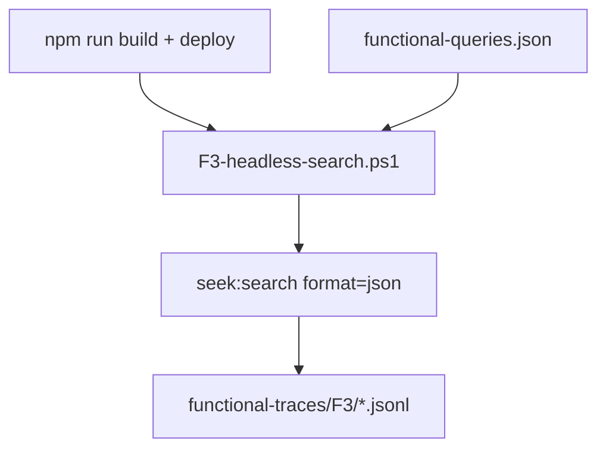

# Seek functional telemetry playbook (F1–F10)

**Dispatch:** [seek-playbook-catalog](../seek-playbook-catalog/SKILL.md) — `run-scenario.ps1 -Id F3 -AllQueryCases`

## Fixtures

- **minimal** — `seek-functional` seeded corpus (~15 notes), probe tokens `seek-probe-NNN`
- **full** — `plugin-sandbox-Obsidian` (~3k notes), vault-polled query matrix

30 query cases = 10 intents × 3 each. Validated by `src/test-harness/functional-telemetry/validate-fixture.test.ts`.

```powershell
.\.cursor\skills\seek-playbook-catalog\scripts\run-scenario.ps1 -Id F3 -FixtureSet full -AllQueryCases
.\.cursor\skills\seek-playbook-catalog\scripts\capture-query-baseline.ps1 -FixtureSet full
```

## Scenarios

| ID | Flow | Mode | Status |
|----|------|------|--------|
| F1 | Restart → index → search ready | cli | **full** |
| F2 | Warm reload → search | cli | **full** |
| F3 | Headless `seek:search` vs expected | cli | **full** |
| F4 | seek:open → active file | cli+eval | **full** |
| F5 | seek:insert-link | cli+eval | **full** |
| F6 | Modal search + restore retry | cli+eval+screenshot | **full** |
| F7 | Modal Alt+Enter insert | cli+eval+screenshot | **full** |
| F8 | Search during catch-up | cli | **full** |
| F9 | Modal early name paint | cli+eval+screenshot | **full** |
| F10 | Rapid query cancel | cli+eval | **full** |

## F3 pass criteria

Each non-sequence `QueryCase.expected` block:

- `minCount` / `maxCount` vs result count
- `rank1Path` / `rank1Contains` vs top hit
- Sequence cases (`gate_blocked`, `superseded_query`) skipped in `-AllQueryCases` until dedicated drivers

## Workflow



Screenshots: `.cursor/telemetry-screenshots/<scenarioId>/` (gitignored). Canvas stores paths only.
