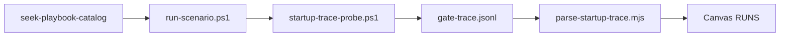

# Seek performance telemetry playbook (S1–S7)

**Dispatch:** [seek-playbook-catalog](../seek-playbook-catalog/SKILL.md) — `run-scenario.ps1 -Id S1` … `-Id S7`

Companion to [seek-cli-startup-debug](../seek-cli-startup-debug/SKILL.md) for timing baselines.

## Baseline rules

- **Never mix Run A and Run B** in one scoreboard row
- **3× runs per scenario** on the same fixture → canvas p50/p95/max
- **Run A** stops at `warmPhase: null` (do not wait for catch-up)
- **Run B** requires idle precheck (`uiHealth: ok`, `job.remaining === 0`)
- **Artifact chain:** probe → `gate-trace.jsonl` → `parse-startup-trace.mjs` → scorecard → canvas `RUNS`

## Scenarios

| ID | Story | Driver | Vault | Key metrics |
|----|-------|--------|-------|-------------|
| S1 | Cold start / full reindex | `S1-cold-start.ps1` | sandbox or dev | T_start_ms, T_hydrate_ms |
| S2 | Incremental catch-up | `S2-incremental.ps1` (stub) | dev + G2 fixture | T_drain_total_ms |
| S3 | First good search after boot | `S3-first-paint.ps1` (stub) | dev G2 | T_first_good_ms |
| S4 | Greedy hydrate walk | `S4-greedy-hydrate.ps1` (stub) | dev G2 | files_walked |
| S5 | Needle rank-1 | `S5-needle.ps1` (stub) | sandbox | T_search_ms |
| S6 | Known-item early paint | `S6-early-name-paint.ps1` | dev | namePartialMs, nameEarlyPainted |
| S7 | Query supersession | `S7-query-supersession.ps1` (stub) | dev | latest query wins |

## Workflow

## S6 fixture (from search-early-name.test.ts)

- `People/Alex Chen.md` — query `alex che`
- `Meetings/Alex 1x1 2026-05-19.md` — query `alex 1x1`
- `Gadgets/Pixel.md` — query `pixel camera review` (control)
