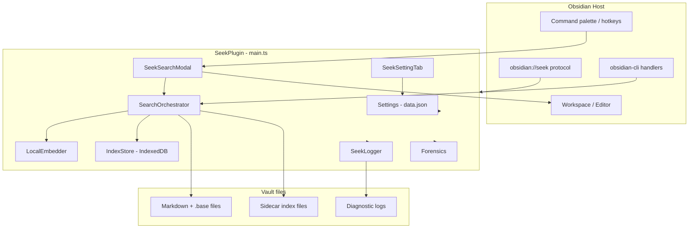
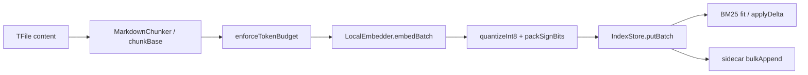
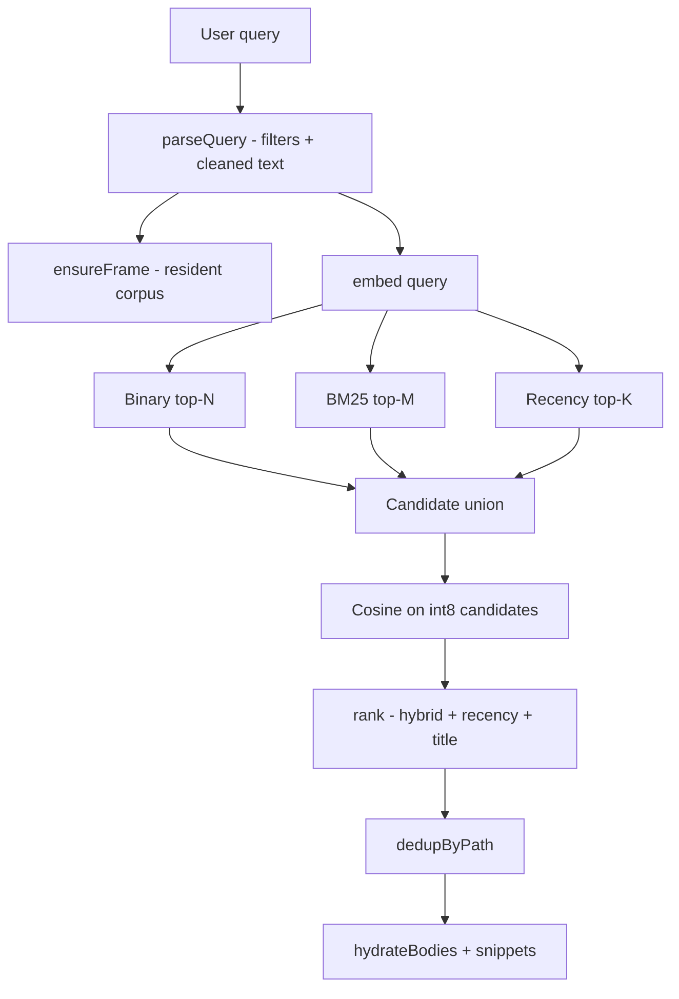
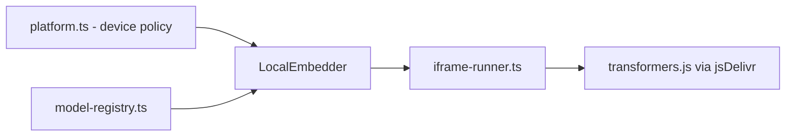

# Seek — Architecture Overview

Seek is an Obsidian plugin that provides **on-device hybrid search** over vault notes. It combines dense semantic embeddings with lexical BM25 retrieval, fuses scores at query time, and runs entirely inside Obsidian — no external API or local server.

This document describes how the codebase is organized, how major subsystems interact, and the main design choices behind the implementation.

---

## Table of contents

1. [System context](#1-system-context)
2. [High-level architecture](#2-high-level-architecture)
3. [Domain map (by folder / module group)](#3-domain-map-by-folder--module-group)
4. [Plugin lifecycle & call orders](#4-plugin-lifecycle)
5. [Indexing pipeline](#5-indexing-pipeline)
6. [Search pipeline](#6-search-pipeline)
7. [Persistence & cross-device sync](#7-persistence--cross-device-sync)
8. [Embedding & compute](#8-embedding--compute)
9. [UI & user interactions](#9-ui--user-interactions)
10. [Settings & configuration](#10-settings--configuration)
11. [Diagnostics & logging](#11-diagnostics--logging)
12. [Build, test & release](#12-build-test--release)
13. [External integration points](#13-external-integration-points)
14. [Design themes](#14-design-themes)
15. [Monolith decomposition & modularization learnings](#15-monolith-decomposition--modularization-learnings)

---

## 1. System context

| Aspect | Detail |
|--------|--------|
| **Runtime** | Obsidian desktop + mobile (not desktop-only) |
| **Entry point** | `src/main.ts` — `SeekPlugin` extends Obsidian `Plugin` |
| **Shipped artifacts** | `main.js` (esbuild bundle), `manifest.json`, `styles.css` |
| **Primary dependency** | [MiniSearch](https://github.com/lucaong/minisearch) for BM25 |
| **Embedding model** | Small on-device Granite multilingual embedder (fixed output dim), via transformers.js in a sandboxed iframe |
| **Storage** | Per-vault IndexedDB + optional vault-file sidecar for sync |

Seek's responsibility is end-to-end: chunk notes → embed → index → parse queries → retrieve → rank → present results → open notes or insert links.

---

## 2. High-level architecture



**Central orchestrator:** `SearchOrchestrator` coordinates indexing and search APIs (`search` / `reindexAll` / `reindexDelta`). Resident query caches (frame, BM25, binary, synonyms) are owned by `CacheManager`; write locking lives on `IndexCoordinator`; sidecar hydrate/compaction on `SidecarCoordinator`. Plugin shell wiring lives on `SeekPlugin`.

---

## 3. Domain map (by folder / module group)

Production code is mostly a **flat `src/` directory** (plus small nested harness/stub/fixture dirs for tests). Domains are expressed by file naming and imports; the tables below are a map of *roles*, not an exhaustive inventory — prefer grepping `src/` when hunting a specific symbol.

### 3.1 Plugin shell & types

| Files | Responsibility |
|-------|----------------|
| `main.ts` | Plugin lifecycle, commands, protocol handlers, model load gate (`SeekPlugin`) |
| `types.ts` | `SeekSettings`, `Chunk`, `ScoredChunk`, query filters, log schema, `DEFAULT_SETTINGS`, migrations |
| `settings-tab.ts` | Settings UI (Index, Relevance, Display, Model, Diagnostics, Reset) |
| `cli-handlers.ts` | Headless CLI command bridge (`seek:search`, `seek:open`, `seek:insert-link`) |
| `plugin-schedulers.ts` | Background debounced flushes, periodic catch-up, folder exclusion watcher, mobile memory watchdog |
| `confirm-modal.ts` | Mobile-safe asynchronous confirmation dialog |
| `drift-recovery-coordinator.ts` | Embed-free drift recovery state machine |
| `diagnostic-report.ts` | Generates vault-root `seek-report.md` summary and `.seek-artifacts/seek-report.json` telemetry |
| `manifest.json` | Obsidian plugin metadata (`id: seek`) |

### 3.2 Search & ranking

| Files | Responsibility |
|-------|----------------|
| `search.ts` | **`SearchOrchestrator`** — indexing coordinator, store facade, write mutex, sidecar exports |
| `cache-manager.ts` | Single authority owning resident query caches (`frameCache`, `bm25Cache`, `binaryIndex`, `synonymCache`) |
| `search-query.ts` | Multi-stage retrieval pipeline (Stage 0 ladder, Stage 1 Hamming + BM25, Stage 2 cosine, TM2C2 fusion) |
| `frame-utils.ts` | Resident frame ops, candidate alignment, delta row helpers |
| `coherence.ts` | Frame/BM25 drift detection, circuit breaker, and recovery decisions |
| `bm25-persist.ts` | Persisted BM25 index identity stamps and compatibility gating |
| `query-parser.ts` | Inline filter syntax (`#tag`, `path:`, `[key:value]`, dates, negation) |
| `fusion.ts` | Score normalization, hybrid fusion, recency ε-tiebreaker, title boost, browse order |
| `ranker.ts` | `rank()` — combines dense + BM25 + recency + title on candidate set |
| `bm25.ts` | Multi-field MiniSearch BM25F (title, aliases, tags, content, properties, headings) |
| `tokenize.ts`, `synonyms.ts`, `tag-grammar.ts` | Tokenization, synonym expansion, tag parsing |
| `select.ts`, `pool.ts` | Top-N selection, candidate pool sizing (√N scaling) |
| `suggest.ts` | Vault metadata dictionaries for filter autocomplete |
| `snippet.ts`, `highlight.ts`, `result-aliases.ts` | Result display helpers |

### 3.3 Indexing & storage

| Files | Responsibility |
|-------|----------------|
| `chunker.ts` | Heading-aware markdown chunking, frontmatter, aliases, link terms |
| `token-budget.ts`, `atoms.ts` | Re-split oversized sections at paragraph/fence/table boundaries (≤512 tokens) |
| `base-extractor.ts` | Obsidian Bases (`.base`) → synthetic chunks |
| `dense-clean.ts`, `prop-normalize.ts` | Dense-channel text hygiene, property normalization |
| `index-store.ts` | IndexedDB schema (chunks, embeddings, binary, BM25 JSON, file records) |
| `index-coordinator.ts` | Write mutex, cache generation, delta visibility, sidecar gate |
| `index-size.ts` | Storage accounting |
| `catchup.ts` | Deferred embed drain when search is idle |
| `pacer.ts` | Compositor-friendly batch pacing during indexing |
| `identity.ts` | Index version fingerprint (model, chunker, analyzer, dim) |

### 3.4 Dense / vector retrieval

| Files | Responsibility |
|-------|----------------|
| `embedder.ts` | Parent-side embed API, load coalescing, query LRU cache |
| `embedder-lifecycle.ts` | Model load/unload policy (mobile idle eviction) |
| `iframe-runner.ts` | Sandboxed transformers.js runtime (WebGPU / WASM) |
| `model-registry.ts` | Active model spec, cache eviction, download probe |
| `platform.ts` | Per-device backend choice (`auto` / `webgpu` / `wasm`), crash demotion |
| `quant.ts` | Int8 quantization + scale for stored vectors |
| `binary.ts`, `binary-scorer.ts`, `binary-worker.ts` | Sign-bit binary index for stage-1 candidate retrieval |
| `dense-stats.ts` | Corpus background stats for display confidence (not ranking) |

### 3.5 Sidecar (cross-device index sync)

| Files | Responsibility |
|-------|----------------|
| `sidecar-coordinator.ts` | High-level sidecar coordinator: hydration, shard compaction, orphan sweeping, live re-chunking |
| `sidecar.ts` | Vault-file index format (JSONL + binary shards, tombstones, CRC) |
| `sidecar-sync.ts` | Hydration from peer device sidecars without re-embedding |
| `sidecar-meta.ts` | Producer metadata, version acceptance gates |

### 3.6 UI

| Files | Responsibility |
|-------|----------------|
| `search-modal.ts` | **`SeekSearchModal`** — results list, debounced search, keyboard model, pagination |
| `query-field.ts` | **`PillQueryField`** — pill filters + contenteditable query, autocomplete |
| `open-target.ts` | Pane targets (`tab`, `split`, `window`), modifier resolution |
| `insert-link.ts` | Wikilink build + editor insertion (Alt+Enter, CLI) |
| `index-notice.ts` | Degraded/stale index banners in modal |
| `styles.css` | Modal, pills, results, footer, mobile viewport CSS |

### 3.7 Diagnostics

| Files | Responsibility |
|-------|----------------|
| `logger.ts` | Per-device NDJSON logs, logging configuration |
| `diagnostic-report.ts` | Diagnostic report compiling, markdown summary and JSON snapshot generation |
| `forensics.ts` | Synchronous localStorage crash breadcrumbs |

### 3.8 Test infrastructure

| Path | Responsibility |
|------|----------------|
| `src/*.test.ts` | Colocated unit/integration tests |
| `src/test-harness/scenario.ts` | Tier-2 composed scenarios (real orchestrator + fake IndexedDB) |
| `src/test-stubs/` | Vitest stubs for `obsidian` API and `window` |
| `src/fixtures/` | Realistic markdown fixtures for chunker/token tests |
| `tests/relevance-cases.json` | Illustrative relevance cases (documentation only, not CI) |

---

## 4. Plugin lifecycle

### 4.1 `onload()` (bootstrap)

Rough order in `SeekPlugin.onload()`:

1. **Logger** — create `SeekLogger`, run log maintenance (migrate, rotate, prune)
2. **Settings** — `loadData()` (BOM-stripped) → `migrateSettings()` → merge with `DEFAULT_SETTINGS`
3. **Index name** — `IndexStore.configure()` binds the per-vault DB name **without** opening IndexedDB
4. **Forensics** — inspect prior session; log crash if unclosed
5. **Orchestrator** — construct `SearchOrchestrator` with store, embedder, settings ref
6. **Settings tab** — register `SeekSettingTab`
7. **Incremental indexing** — wire vault/workspace event listeners
8. **`onLayoutReady`** — then start startup clocks, `IndexStore.open()`, sidecar hydrate, identity, reconcile
9. **Intervals** — periodic reconcile; mobile idle embedder unload
10. **Observers** — global errors, long tasks, memory pressure
11. **Embedder init** — `embedder.init()` (non-blocking; model loads lazily)
12. **Integration** — command, `obsidian://seek` protocol, optional CLI handlers

Do **not** `await onLayoutReady()` inside `onload` (that can deadlock). Use the callback form. Until that gate, Seek must not time startup, probe IndexedDB, or treat core File Recovery / cache / sync IndexedDB errors as Seek failures.

Model weights are **not** loaded at startup. First search or reindex calls `ensureModelLoaded()`.

### 4.2 `onunload()` (teardown)

Synchronous clean end: mark forensics session closed → teardown embedder iframe → dispose orchestrator → close IndexedDB → disconnect observers and timers.

### 4.3 Indexing schedulers (`plugin-schedulers.ts`)

| Mechanism | Role |
|-----------|------|
| Vault file events | Queue dirty files for incremental reindex |
| `flushDirty()` | Debounced delta embed after edits (longer idle for text; faster for deletes/renames) |
| `runCatchUp()` | Drains backlog when search is idle; periodic scheduler |
| `reconcileFolderExclusions()` | Reconciles inclusion/exclusion folder list diffs |
| `maybeUnloadEmbedder()` | Mobile idle memory watchdog (unloads embed iframe after quiescence) |
| `indexingBlocked` | Pauses embeds while an active search query is in flight |

### 4.4 Lifecycle Workflows & Call Order Sequences

The execution flow of Seek is governed by four primary asynchronous workflows with strict call order prerequisites and concurrency invariants:

```mermaid
flowchart TD
    subgraph BootWorkflow [1. Boot & Initialization Workflow]
        B1[1. SeekLogger init & session boot] --> B2[2. IndexedDB lock acquisition with backoff]
        B2 --> B3[3. IndexStore.open & schema verify]
        B3 --> B4[4. SearchOrchestrator instantiation]
        B4 --> B5[5. SidecarCoordinator.hydrateFromSidecar - MUST precede catchup]
        B5 --> B6[6. CacheManager.warmCaches]
        B6 --> B7[7. PluginSchedulerManager wire-up - vault listeners]
        B7 --> B8[8. Initial runCatchUp pass]
        B8 --> B9[9. Register CLI handlers & UI commands]
    end

    subgraph QueryWorkflow [2. Search Query Pipeline]
        Q1[1. SearchQuery.parseQuery] --> Q2{Empty or filter-only?}
        Q2 -->|Yes| Q3[Stage 0: Instant browse or vault ladder]
        Q2 -->|No| Q4[CacheManager.ensureFrame - verify generation freshness]
        Q4 --> Q5[Parallel: query embed plus BM25 search]
        Q5 --> Q6[BinaryScorerWorker - 1-bit Hamming distance]
        Q6 --> Q7[Candidate pool union via poolCaps]
        Q7 --> Q8[Stage 2: Dense cosine rerank on top candidates]
        Q8 --> Q9[Stage 3: TM2C2 score fusion]
        Q9 --> Q10[Snippet hydration & return ScoredChunk[]]
    end

    subgraph EditWorkflow [3. Incremental Edit & Flush Workflow]
        E1[Vault modify / delete event] --> E2[PluginSchedulerManager.queueDirty]
        E2 --> E3[Debounce: 5m idle for edits / 1.5s for deletes]
        E3 --> E4{isQueryInFlight active?}
        E4 -->|Yes| E5[Yield and retry on next tick]
        E4 -->|No| E6[IndexCoordinator.runExclusive write mutex]
        E6 --> E7[Compute file delta & embed new chunks]
        E7 --> E8[Commit to IndexStore & append to sidecar]
        E8 --> E9[Lockstep CacheManager mutation: appendFrameRows + bm25.add]
        E9 --> E10[frameBm25Coherent spot check]
    end

    subgraph DriftWorkflow [4. Drift Recovery Workflow]
        D1[Spot check fails beyond cooldown] --> D2[DriftRecoveryCoordinator.onPersistentDrift]
        D2 --> D3{Already running OR lastRecoveryGen == currentGen?}
        D3 -->|Yes| D4[Suppress redundant pass]
        D3 -->|No| D5{document.hidden?}
        D5 -->|Yes| D6[Defer until window focused]
        D5 -->|No| D7[Embed-free sidecar hydration]
        D7 --> D8[CacheManager.warmCaches & verifyCoherent]
        D8 --> D9[Transition indexHealth: healthy or degraded]
    end
```

#### Detailed Call Order Sequences

1. **Boot & Initialization Sequence**:
   - `initLogger()` initializes `SeekLogger` and verifies session generations.
   - `createStoreOpenRetryScheduler()` acquires the IndexedDB lock with exponential backoff to handle multi-window contention.
   - `IndexStore.open()` verifies `META_SCHEMA_VERSION` and identity.
   - `SearchOrchestrator` constructs sub-coordinators (`IndexCoordinator`, `CacheManager`, `SearchQuery`, `SidecarCoordinator`).
   - `sidecarCoordinator.hydrateFromSidecar()` runs **before** catch-up to load peer-embedded chunks into IndexedDB.
   - `cacheManager.warmCaches()` loads the resident frame and BM25 index into RAM.
   - `PluginSchedulerManager` registers Obsidian vault event listeners (`modify`, `delete`, `rename`).
   - `runCatchUp()` indexes offline modifications.
   - Registers UI commands, modal hotkeys, settings tab, and headless CLI handlers (`seek:search`, `seek:open`, `seek:insert-link`).

2. **Search Query Pipeline**:
   - Parse query terms, tags, and field filters.
   - Fast path: empty or filter-only queries can skip the dense path (vault ladder, filter browse, or frame browse-order depending on frame warmth).
   - Ensure the resident frame and check generation freshness.
   - Parallel work: query embedding (iframe by default; optional nested worker when enabled) and in-memory multi-field BM25.
   - Binary stage-1 Hamming over packed sign vectors (desktop may offload to a DedicatedWorker).
   - Candidate pool union sized from corpus scale (√N-style caps).
   - Top candidates undergo int8 cosine rerank, then TM2C2 fusion into scored results.

3. **Incremental Edit & Flush Workflow**:
   - Vault events queue dirty paths; structural changes flush sooner than idle text edits.
   - Background flush yields while a query is in flight, then takes the write mutex.
   - Compute file diffs, embed via rolling token-budget batches, commit to IndexedDB / sidecar.
   - Mutate resident caches in lockstep with the store write; spot-check frame/BM25 coherence.

4. **Drift Recovery Workflow**:
   - Persistent coherence failures trigger embed-free sidecar hydration (single-flight per generation; deferred while the window is hidden).
   - Re-warm caches, re-verify coherence, then mark index health healthy or degraded.

#### Key Order Dependencies & Concurrency Invariants

- **Hydration before catch-up indexing** — peer sidecar ingest must finish before catch-up diffs the vault, or synced notes get redundantly re-embedded.
- **Write mutex** — all mutations to IndexedDB, sidecar files, or memory frames serialize through the index write lock.
- **Zero dual-cache** — resident query structures are owned exclusively by `CacheManager`; the orchestrator must not keep a parallel copy.
- **Generation freshness** — frame builds capture the write generation before IDB reads and discard the assembly if a write landed mid-read.
- **UI & query priority** — background flushes yield whenever a search query is in flight.

---

## 5. Indexing pipeline



### Chunking (`chunker.ts`)

- Splits notes at heading boundaries; builds hierarchical titles (`Note > H1 > H2`)
- Extracts frontmatter tags, aliases, properties, dates
- Produces `link_terms` for BM25-only wikilink reclamation
- Applies `denseSuffix` from frontmatter values (dense channel only)
- Falls back to title-only chunks for empty notes (`lexicalOnly`)
- `CHUNKER_VERSION` gates sidecar compatibility

### Chunk identity

`chunkIdFor(notePath, title, content, denseSuffix)` — path-salted hash. IDs must be reproducible for sidecar hydration (re-chunk live file, intersect with sidecar records).

### Full vs incremental

| Mode | Trigger | Behavior |
|------|---------|----------|
| **Full reindex** | Settings → Reindex | Nuke IDB, walk all indexable files, embed all chunks, fit BM25, write sidecar |
| **Incremental delta** | File save/create/delete | Delete stale chunks, embed only changed chunks, `applyDelta()` on BM25 frame |

Writes are serialized through `IndexCoordinator.runExclusive()`. In-flight deltas block `ensureFrame()` so searches never read a half-updated corpus.

### Rolling embed batches

Embedding is the slow part of indexing: each chunk goes through the on-device model in a **batch** to produce dense vectors. One call per chunk wastes setup; mixing very different lengths in one call wastes compute on padding. Seek therefore uses **per-bucket rolling buffers** on the index path.

**Plain idea.** Notes are split into chunks. Each chunk’s exact token count maps to a sequence-length **bucket**. Chunks land in a buffer for that bucket. When the buffer is full enough, Seek flushes one `embedBatch`. Leftovers carry across the next files — that is the “rolling” part. Same-bucket flushes pad to one warmed shape instead of to the longest stranger in a mixed batch.

| Knob | Role |
|------|------|
| **Max batch size** (`ROLLING_MAX`) | Hard ceiling on how many chunks may share one forward |
| **Token budget** (`ROLLING_BUDGET`) | Target `batch × seq` work per dispatch — long buckets flush smaller so one GPU/CPU forward does not stall the UI as hard |
| **Warmup grid** | Batch sizes and seq rungs the embed runtime warms at model load; live flush sizes must stay inside that set |
| **Device ceiling helper** | Platform helper documenting a higher desktop cap — not what the rolling flush uses today |

Flush size is derived, not a flat constant:

```text
flushCount(bucket) ≈ clamp(round(ROLLING_BUDGET / bucket), 1, ROLLING_MAX)
```

Read the live constants next to that helper on the index path — do not copy historical yield tables from comments or older docs; they drift when the budget changes.

**Why two knobs.** Max batch size is “how full is the dishwasher rack.” Token budget is “how much work is allowed in one wash.” Raising only the max helps short buckets; long buckets stay small until the budget rises too. Raising either without extending the warmup grid risks cold shader compiles mid-reindex and historically triggered ORT-Web WebGPU **SafeInt** overflows on arbitrary `(batch × seq)` shapes.

**Throughput context.** On desktop WebGPU, indexing is largely GPU-bound. Moving inference to a background worker does not by itself raise chunks/s; larger batches can, at the cost of longer non-preemptible stalls, thermal load, and SafeInt risk. After a reindex, trust `index-complete` embed throughput / batch latency / pace-wait / recycle fields before treating a higher cap as a win. A compositor pacer still yields between flushes so Obsidian can paint.

**Query vs index.** Optional per-device “query in background worker” routing (when enabled) applies to single-query embeds only. Index batches stay on the iframe pipeline so token-exact bucket padding matches the warmup grid.

### IndexedDB stores (`index-store.ts`)

| Store | Contents |
|-------|----------|
| `chunk_meta` | Metadata without body |
| `chunk_body` | Chunk text content |
| `embeddings` | Quantized int8 vectors + scale |
| `binary` | Sign-bit packed vectors for fast scan |
| `files` | Per-note mtime, content hash, chunk id list |
| `meta` | Singleton (model id, dim, chunker version, bg stats) |
| `bm25` | Persisted MiniSearch JSON + analyzer stamp |

---

## 6. Search pipeline



### Stage summary

| Stage | What it does |
|-------|----------------|
| **Parse** | Extract inline filters; produce `cleanedQuery` for embedding/BM25 |
| **Frame** | Load metadata + binary index + optional resident int8 block into RAM |
| **S1a** | Binary asymmetric scan (desktop: off-thread worker) |
| **S1b** | Multi-field BM25 with fuzzy, prefix, synonym, coverage soft-AND |
| **S1c** | Recency pool for browse/filter-only paths |
| **Union** | Merge candidate indices; pool size scales as √N |
| **S2** | Dequantize int8 → cosine similarity on union only |
| **S3** | `rank()` fusion, note-level dedup, body fetch, snippet render |

**Filter-only queries** (pills/filters with no free text) skip embedding and sort via `browseOrder()`.

### Fusion (`fusion.ts` + `ranker.ts`)

- TM2C2-style normalization: cosine mapped to [0,1], BM25 divided by theoretical query bound
- `hybrid = α·dense + (1-α)·bm25` where `α` is the dense-weight setting
- Recency is an additive ε-tiebreaker, not a multiplicative boost
- Title boost rewards query terms that are a subset of the note title

---

## 7. Persistence & cross-device sync

Seek uses **two persistence layers**:

### 7.1 IndexedDB (local, per device)

Fast query path. Can be evicted on iOS WebView → sidecar recovers without re-embedding.

### 7.2 Sidecar (vault files, synced)

Written to `.obsidian/plugins/seek/index/` (default) or vault-root `Seek Index/` (split-config Obsidian Sync workaround).

| Artifact | Purpose |
|----------|---------|
| `index.<deviceId>.jsonl` | Chunk id → shard offset map |
| `embeddings.<deviceId>.<seq>.bin` | Packed int8 vectors (sized shards) |
| `meta.<deviceId>.json` | Format version, model, chunker, dim |

**Hydration** (`sidecar-sync.ts`): re-chunk live vault files, intersect chunk ids with sidecar records, decode vectors into IndexedDB — no re-embed if identity matches.

**Identity gates** (`identity.ts`, `sidecar-meta.ts`): model repo, chunker version, embedding dim, analyzer stamp must match before accepting a sidecar producer.

---

## 8. Embedding & compute



### Why an iframe?

Obsidian's CSP blocks remote `import()` in the main plugin context. A sandboxed `srcdoc` iframe loads transformers.js with a permissive CSP.

### Backend selection (`platform.ts`)

| Device class | Default | Override |
|--------------|---------|----------|
| Desktop, iPad | `auto` (WebGPU → WASM fallback) | Settings → Force CPU / WebGPU |
| iPhone, Android | `wasm` | Stored in **localStorage** (not synced) |

Crash demotion can sticky-force WASM after mobile GPU jetsam.

### Model

- **Spec:** Active entry in the model registry (Granite multilingual, fixed dim, q4-class weights) — the registry is the identity stamp source of truth
- **Warmup:** shader/grid warmup in the embed iframe; fingerprint can skip a repeat warmup when config is unchanged
- **Query route (optional):** per-device localStorage toggle can send single-query embeds to a nested dedicated worker; iframe remains automatic fallback. Index `embedBatch` does not use that route.

### Model compatibility

Not every Hugging Face “embedding” checkpoint works with Seek. The load path assumes a **dense bi-encoder** that transformers.js can run as `feature-extraction` inside the srcdoc iframe. The registry (`model-registry.ts`) and iframe (`iframe-runner.ts`) encode the invariants below. Output dimension and preferred dtype come from the **compiled** active spec (`ACTIVE_MODEL_SPEC`); transformers.js derives ONNX filenames from dtype. `ModelSpec.files` is metadata for documentation and cache probing, not the runtime filename source.

| Filter | Requirement |
|--------|-------------|
| **Task** | One forward → one fixed vector per text (bi-encoder). Not a cross-encoder/reranker, generative LLM embed API, sparse-only model, or static token embedding — those need a different pipeline. |
| **Runtime** | Hugging Face repo with `config.json`, a tokenizer transformers.js understands, and ONNX under `onnx/`. The q4 / WASM path needs `model_q4.onnx`; WebGPU may retry fp32 `model.onnx`. Ops must run on the pinned transformers.js / ORT-Web WebGPU or WASM path. |
| **Pooling / prefixes** | The iframe always calls `pooling: 'cls', normalize: true` and does **not** prepend `query:` / `passage:` (or similar). Cards that require mean pooling or asymmetric prefixes can still *load* and produce wrong rankings. |
| **Geometry** | Output width is the compiled `ACTIVE_MODEL_SPEC.dim` (injected as `OUTPUT_DIM`). Native width must be ≥ that dim (narrower fails loud). Wider outputs are first-N sliced and renormalized — the model must support that prefix/Matryoshka semantics, or declare dim equal to native width. Model ID, **revision**, dim, and chunker version invalidate the local dense index (`identity.ts`); compatible sidecar hydration may avoid re-embedding. Sidecar producers that mismatch model ID, revision, chunker, or dim are refused. |
| **Sequence** | Seek drives the warmed seq-bucket grid through a 512-token dense cap and does **not** adapt to a lower native model maximum — a sub-512 max may fail the forward rather than truncate gracefully. BM25 still sees the full chunk text. (WebGPU pads to the bucket; WASM pads to the batch’s longest input.) |
| **Debug override** | `modelRepoOverride` / `modelRevisionOverride` keep the shipped q4 / dimension / CLS / no-prefix contract. They are not a general model picker. The optional query-worker route is compiled to the active shipped spec (q4, fixed dim, 128-token cap) and does not follow overrides — disable that route when testing an override. |

**How to hunt candidates:** prefer `feature-extraction` (or equivalent) with an ONNX / transformers.js export; then check the card for CLS vs mean pooling, required prefixes, embedding dim, max sequence length (≥ 512), and transformer layer count (the main speed axis). Any accepted swap still needs a vault bake-off and a dense reindex (or compatible-sidecar hydrate).

### Vector storage

- Full vectors stored as **int8 + per-vector scale**
- **Sign bits** packed for binary stage-1 scan
- Stage-2 rerank dequantizes only the candidate union (not the full corpus)

---

## 9. UI & user interactions

### Search modal (`search-modal.ts`)

`SeekSearchModal` is a custom `Modal` (not `SuggestModal`):

| Component | Role |
|-----------|------|
| `PillQueryField` | Query input with inline filter pills |
| Results list | Reconciled row pool, infinite scroll (page of visible rows / larger fetch window) |
| Index banner | Stale/syncing notices |
| Footer | Keyboard hints (toggleable) |

**Keyboard model** (defaults; remappable in Settings → Hotkeys under Seek: Search:*):

| Default | Action |
|---------|--------|
| Enter | Open in active pane; close modal |
| ⌘/Ctrl+Enter | Open in new tab; close modal (default). Opt-in Display setting **Keep search open when opening in new tab or split** restores fan-out (modal stays open, leaf inactive). |
| ⌘/Ctrl+Alt+Enter | Open in split pane; same dismiss / fan-out rule as new tab |
| Alt+Enter | Insert plain wikilink at editor cursor (desktop) |
| Alt+Shift+Enter | Insert wikilink with search free text as alias (desktop) |
| ↑/↓ | Navigate results (or recent searches when resting) |
| Tab | Fill autosuggest |
| ⌘/Ctrl+Shift+E | Expand snippet |
| Esc | Close |

Debounced input (longer on mobile). Catch-up indexing pauses while search is active.

### Query field / pills (`query-field.ts`)

Pills serialize to the same inline syntax the backend parses:

- `tag:value`, `path:folder/*`, `after:YYYY-MM`, `[key:value]`

`SuggestEngine` provides autocomplete from vault tags, paths, and property keys. `getFreeText()` returns non-pill text used as the link alias on Alt+Shift+Enter.

### Open targets (`open-target.ts`)

Shared by modal, `obsidian://seek?mode=open`, and `seek:open` CLI. `resolveOpenTarget()` maps modifiers via `Keymap.isModEvent()`. Mobile normalizes `split` → `tab`.

### Insert link (`insert-link.ts`)

- **Alt+Enter** — plain `[[Note]]` at the active editor cursor (selection untouched)
- **Alt+Shift+Enter** — `[[Note|search free text]]` when free text is non-empty; otherwise plain link
- Builds links via `app.fileManager.generateMarkdownLink()`
- Subpath (`#heading`) optional via `insertLinkIncludeHeading` setting
- CLI: `seek:insert-link query=… rank=… alias=… heading=true|false` (plain link unless `alias=` is set)

---

## 10. Settings & configuration

### Persisted (`data.json`, synced across devices)

`SeekSettings` (see defaults + migrations in types) — ranking, indexing, display, and schema-revision fields. Examples:

| Group | Examples |
|-------|----------|
| **Ranking** | Dense weight, title boost, recency ε / half-life, fuzzy |
| **Indexing** | Honor ignored folders, index Bases, searchable properties, sidecar on/location |
| **Display** | Scores, hotkey hints, insert-link heading, snippet preview, modal size, aliases |
| **Schema** | `settingsRev` + `migrateSettings()` on load — current rev lives in defaults, not this overview |

`this.settings` is a live object shared with `SearchOrchestrator` — ranking changes apply on the next search without reindex.

### Per-device (not in `data.json`)

| Setting | Storage |
|---------|---------|
| Compute backend (`auto` / `wasm` / `webgpu`) | `localStorage` (per device) |
| Optional query embed worker route | `localStorage` (desktop experiment) |
| WebGPU crash demotion flag | `localStorage` |
| Device id for logs | `localStorage` |

---

## 11. Diagnostics & logging

### SeekLogger (`logger.ts`)

Per-device NDJSON append log:

```
.obsidian/plugins/seek/logs/seek-log-<deviceId>.ndjson
.obsidian/plugins/seek/logs/seek-init-<deviceId>.json
```

Generates a human-readable summary at vault root (`seek-report.md`) and a structured JSON dump under `.seek-artifacts/` for offline analysis.

Logs search queries, ranking signals, indexing events, errors. **No telemetry leaves the device.**

### Forensics (`forensics.ts`)

Synchronous `localStorage` ring buffer during indexing. Unclosed session at boot → crash entry with verdict (memory kill, GPU termination, etc.).

### Build-time stamps

esbuild injects `__PLUGIN_VERSION__`, `__SEEK_ANALYZER_VERSION__` (BM25 invalidation), `__BINARY_WORKER_SRC__` (inline worker).

---

## 12. Build, test & release

### Build (`esbuild.config.mjs`)

Single `main.js` bundle (CommonJS, ES2022):

1. **Binary worker** — `binary-worker.ts` bundled to IIFE string, injected as `__BINARY_WORKER_SRC__`
2. **Main plugin** — `main.ts` entry, externals: `obsidian`, `electron`

```bash
npm run dev      # watch + inline sourcemaps
npm run build    # production minify
npm run typecheck
npm test         # vitest run
```

### Test strategy

| Tier | Scope | Location |
|------|-------|----------|
| **Unit** | Pure functions, isolated modules | Colocated `*.test.ts` |
| **Composed** | Full orchestrator + fake IndexedDB | `test-harness/scenario.test.ts` |

CI (`.github/workflows/ci.yml`): Node 22 → typecheck → test → build on push/PR.

### Release

Tag push (no `v` prefix) → build → Sigstore attestation → draft GitHub release with `main.js`, `manifest.json`, `styles.css`.

### Local dev loop

1. `npm run dev` in repo
2. Copy `main.js`, `manifest.json`, `styles.css` to `.obsidian/plugins/seek/`
3. `obsidian plugin:reload id=seek`

---

## 13. External integration points

| Integration | Entry | Purpose |
|-------------|-------|---------|
| **Command palette** | `seek:search` | Open search modal |
| **Protocol URL** | `obsidian://seek?query=…&mode=open&paneType=tab` | Deep links, automation |
| **CLI** (desktop + obsidian-cli) | `seek:search`, `seek:open`, `seek:insert-link` | Headless search, open, insert link |
| **Settings** | Settings → Seek | Reindex, relevance tuning, diagnostics |

CLI handlers register only when `registerCliHandler` exists on the plugin instance (Obsidian 1.12.7+ with CLI bridge).

---

## 14. Design themes

1. **Two-stage retrieval** — Cheap binary + BM25 + recency union, then expensive cosine only on hundreds of candidates, not the full corpus.

2. **Frame-lite hot path** — Metadata and packed vectors in RAM; bodies fetched lazily for BM25 refit, negation, and top-K display.

3. **Generation-keyed caches** — BM25, binary index, and resident frame stay coherent via `IndexCoordinator.generation`; invalidated on delta or full rebuild.

4. **Path-salted chunk IDs** — Correct incremental delete; sidecar hydration reproduces IDs by re-chunking live files.

5. **TM2C2 fusion** — Fixed-endpoint score normalization avoids per-query min-max that can manufacture false dense winners on out-of-vocabulary queries.

6. **Synced settings vs per-device compute** — Ranking preferences sync via `data.json`; GPU/CPU choice stays local because WebGPU availability differs per device.

7. **Sidecar as sync transport** — IndexedDB is the query engine; vault files are the durable, iCloud/Obsidian-Sync-friendly backup that lets mobile recover without re-embedding.

8. **Lazy model load** — Plugin boots fast; embedding model downloads and initializes on first search or reindex.

---

## 15. Monolith decomposition & modularization learnings

During decomposition of Seek’s large host and orchestrator modules, critical architectural lessons, phase order requirements, and anti-patterns were established to keep a large single-threaded Obsidian plugin stable.

### 15.1 The Zero-Dual-Cache Principle & Anti-Patterns
In an earlier refactor attempt, `CacheManager` and `SearchQuery` were copied out of `SearchOrchestrator`, but original cache fields and implementations were left in place:
- `SearchOrchestrator` still owned `frameCache`, `bm25Cache`, and `ensureFrame()`.
- `SearchQuery` was constructed but never delegated to — creating dead code.
- Incremental deletion (`wantRemovalBodies`) checked one cache owner while `applyDelta` read another, causing silent removal-body bugs and desynchronization.

| Anti-pattern | Consequence | Rule |
| :--- | :--- | :--- |
| **Copy class out, leave orchestrator copy** | Dual cache drift, non-deterministic bugs; tests pass on dead instance while live path fails. | Never leave duplicate implementations. Code must be moved and original fields deleted or delegated in the exact same change. |
| **Instantiate extracted class without delegating** | Dead code and misleading "contract tests" that don't execute the extracted class. | Delegate immediately on extraction; verify callers hit the extracted instance. |
| **Split cache ownership across multiple objects** | Subtly desynchronized states between readers and writers (e.g. `wantRemovalBodies` vs `applyDelta`). | Single-authority state ownership is non-negotiable (`CacheManager` is sole cache owner). |
| **Extract before composing integration tests** | No safety net for subtle delta application and search interactions. | Gate every extraction on Tier-2 composed pipeline tests (orchestrator + fake IndexedDB / embedder). |

### 15.2 Decomposition Phase Order (Leaf-First to Coordinator)
To decompose large interconnected monoliths safely without introducing regressions:
1. **Phase 1: Pure Stateless Helpers First**: Extract leaf utilities that touch no instance state (frame helpers, coherence, BM25 persist stamps). Re-export at tail for backwards compatibility.
2. **Phase 2: Extract State Authorities Next**: Establish the single source of truth for in-memory structures (`CacheManager`) before extracting consumers. Delete orchestrator cache fields in the same commit.
3. **Phase 3: Extract Retrieval / Consumer Pipelines**: Extract the query execution engine and delegate from the orchestrator.
4. **Phase 4: Extract Durability & Sync**: Isolate high-conflict sidecar hydration and compaction.
5. **Phase 5: Extract Host Lifecycle & Schedulers**: Isolate background debounce timers, watchers, CLI handlers, drift recovery, and diagnostic reporting.

### 15.3 Contract Testing & Integration Safety Net
Unit tests on isolated functions cannot detect regressions caused by cross-module lifecycle interactions (e.g. delta application + search query interleaving, progressive partial ordering, or cache invalidation).
- Always gate extractions against Tier-2 composed integration tests that boot a real `SearchOrchestrator` + `IndexStore` against a deterministic fake embedder (see `test-harness/` and colocated pipeline tests).

### 15.4 Remaining Seams (Candidate Write Slices)
If further write-pipeline decomposition is needed, the large remaining seams are:
- Incremental delta apply (removal-body capture, BM25/frame patch).
- Shared embed-and-commit loop (pacer, token-budget rolling buffers, quota gating) used by full and incremental indexing.

---

## Related docs

- [SEARCH-DECOMPOSITION.md](./archive/SEARCH-DECOMPOSITION.md) — archived decomposition roadmap and reference (phase order, anti-patterns, test gates)
- [seek-architecture.canvas.tsx](./seek-architecture.canvas.tsx) — interactive Cursor canvas (system map, index/search/persistence drill-downs)
- [README.md](../README.md) — user-facing install and privacy summary
- [CHANGELOG.md](../CHANGELOG.md) — release history
- [User guide](https://publish.obsidian.md/rmm/Seek+Documentation/About+Seek) — external documentation
- [Evaluation notes](https://publish.obsidian.md/rmm/Seek+Documentation/Seek+Evaluation+%26+Development) — relevance tuning context
