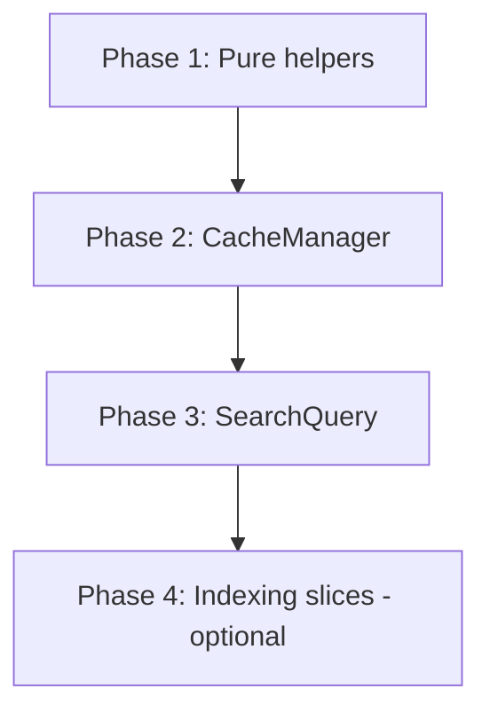

# SearchOrchestrator decomposition guide

`src/search.ts` is ~5,300 lines and owns indexing, sidecar hydration, in-memory caches, and the full search pipeline. It is the highest-churn module in the repo. This document records **how to split it safely** — lessons from a 2026-08/09 refactor attempt (`refactor/decompose-search`) and the follow-up PR that landed only the merge-ready slice.

**Related:** [ARCHITECTURE.md §6 Search pipeline](./ARCHITECTURE.md#6-search-pipeline), `src/search-integration.test.ts` (full-pipeline contract tests), `src/test-harness/scenario.ts` (Tier-2 harness).

---

## Goals

1. **Shrink the edit surface** — search-path features (progressive partials, embed worker routing, filter syntax) should not require reading 5k lines of indexing code.
2. **Keep one source of truth** — no duplicate cache fields or parallel implementations.
3. **Preserve behavior exactly** — decomposition is refactor-only until a deliberate behavior change is scoped separately.
4. **Stay mergeable** — small PRs that rebase cleanly against active `main` work.

---

## What worked (landed or PR-ready)

### Phase 1 — Pure helpers (low risk, do first)

Extract **stateless functions and small types** that do not touch orchestrator fields:

| Module | Contents | Consumers |
|--------|----------|-----------|
| `frame-utils.ts` | `ResidentFrame`, `DeltaAdd`, `alignCandidate`, `appendFrameRows`, `tombstoneFrameRows`, `buildResidentRerankBlock`, frame row helpers | Search path, delta apply, tests |
| `coherence.ts` | `frameBm25Coherent`, drift/recovery decisions, coherence sample constants | Cache warm, delta apply, diagnostics |
| `bm25-persist.ts` | `buildBm25Stamp`, `bm25StampMatches`, persist identity types | BM25 load/save, sidecar reconcile |

**Pattern:**

1. Copy functions to the new file unchanged.
2. Import in `search.ts`; replace inline definitions with **re-exports** at the file tail so existing `import { alignCandidate } from './search'` call sites keep working.
3. Add or extend unit tests on the extracted module where cheap; rely on `search-integration.test.ts` for pipeline contracts.

PR [#25](https://github.com/adrianghnguyen/Obsidian-Seek/pull/25) (`refactor/search-module-extract`) is the reference implementation.

### Integration tests before structural moves

`search-integration.test.ts` (27 tests, I/Q/P/T/F series) exercises the real `SearchOrchestrator` + `IndexStore` + fake embedder. Run it after every extraction step:

```bash
npm test -- src/search-integration.test.ts
```

It catches regressions that unit tests on isolated helpers miss (delta apply + search, progressive partial ordering, filter-only browse, telemetry fields).

---

## What failed (do not repeat)

A checkpoint branch copied `CacheManager` and `SearchQuery` out of the orchestrator **without deleting the originals**:

- `SearchOrchestrator` still owned `frameCache`, `bm25Cache`, `ensureFrame()`, `warmCaches()`, `search()`, `searchLexicalOnly()`.
- `SearchQuery` was constructed but **never delegated to** — dead instance, duplicated logic.
- `CacheManager` was partially wired (`isWarmingCaches` only) while the live search path used orchestrator fields.
- Incremental delete (`wantRemovalBodies`) checked one cache owner and `applyDelta` read another → subtle removal-body bugs.

**Rule:** Never merge a decomposition PR that adds extracted classes **and** leaves the orchestrator implementations in place. One PR must **move** code, not **copy** it.

---

## Recommended phase order



### Phase 2 — `CacheManager` (single cache owner)

**Scope:** Everything keyed on `IndexCoordinator.generation`:

- `frameCache`, `binaryIndex`, `bm25Cache`, `synonymCache`, `bgStatsCache`
- `ensureFrame()`, `ensureBm25()`, `warmCaches()`, `invalidateBm25Cache()`
- BM25 persist throttle / idle persist
- `isWarmingCaches()`, `awaitWarmCachesIfInFlight()`

**Shared state:** Pass `IndexCoordinator` by reference. CacheManager reads `coord.generation`, `coord.currentDelta`, `coord.isWriting()` — it does **not** own the coordinator.

**Migration checklist (same PR):**

- [ ] Delete orchestrator cache fields and methods after delegation
- [ ] Indexing paths (`reindexDelta`, `applyDelta`, sidecar hydrate) call `cacheManager.invalidate…` / `cacheManager.warmCaches` — not local duplicates
- [ ] `dispose()` cancels `cacheManager.pendingPersistIdle` only
- [ ] Contract tests instantiate `CacheManager` via the orchestrator's single instance — no second cache

### Phase 3 — `SearchQuery` (query path only)

**Scope:**

- `search()`, `searchLexicalOnly()`
- Query telemetry assembly (`SearchEntry`, `onPartial` progressive stages)
- Filter context build, empty-query browse fast path

**Dependencies:** `CacheManager`, `BinaryScorerWorker`, `IndexCoordinator`, settings ref, embedder, logger.

**Migration checklist (same PR):**

- [ ] `SearchOrchestrator.search()` becomes a one-line delegate: `return this.searchQuery.search(...)`
- [ ] No second copy of `dedupByPath` / `topKByScore` — live in `search-query.ts` or a shared helper
- [ ] Modal, CLI, and `seek:search` unchanged (they call `orch.search`, not `SearchQuery` directly)

### Phase 4 — Indexing slices (optional, highest conflict risk)

Only after Phases 1–3 are stable. Candidate seams (each is a multi-day effort):

| Slice | Rough lines | Notes |
|-------|-------------|-------|
| Sidecar hydrate / reconcile | ~400 | Tight coupling to `IndexCoordinator` write mutex |
| `reindexDelta` / `applyDelta` | ~800 | Removal-body capture, incremental BM25 patch |
| Full reindex / embed loop | ~600 | Pacer, rolling buffers, quota gate |

Prefer **feature-local extractions** (e.g. move sidecar flush helpers to `sidecar-sync.ts`) over a monolithic `IndexingPipeline` class until search-path decomposition is done.

---

## Module boundaries inside `search.ts` (current)

Use these line anchors when planning moves (approximate — verify after edits):

| Region | Responsibility | Extraction status |
|--------|----------------|-------------------|
| Constructor / `dispose` | Wire deps, teardown worker + idle persist | Stays in orchestrator |
| `reindexAll` / embed loop | Full rebuild, rolling buffers | Phase 4 |
| `reindexDelta` / `applyDelta` | Incremental index + cache patch | Phase 4 (calls into CacheManager after Phase 2) |
| `hydrateSidecar` | Peer sidecar import | Phase 4 |
| `search` / `searchLexicalOnly` | Two-stage hybrid retrieval | Phase 3 |
| `ensureFrame` / `warmCaches` / cache fields | Resident corpus + BM25 | Phase 2 |
| Tail exports (`alignCandidate`, …) | Back-compat re-exports | Phase 1 → move to `frame-utils.ts` |

`IndexCoordinator` (`index-coordinator.ts`) is the precedent: shared write mutex + generation counter extracted early because both halves needed it.

---

## PR hygiene

1. **One phase per PR** — do not combine Phase 2 and Phase 3.
2. **Rebase often** — search and embedder paths change weekly on `main`.
3. **No version bump** — internal refactor + tests only unless user-visible behavior changes.
4. **Full test gate:** `npm run typecheck && npm test && npm run build`.
5. **No sandbox deploy required** for pure refactor PRs unless a runtime probe is explicitly requested.
6. **Re-export during migration** — external imports from `./search` may exist in tests and forks; drop re-exports only after grep confirms zero callers.

---

## Anti-patterns

| Anti-pattern | Why it hurts |
|--------------|--------------|
| Copy class out, leave orchestrator copy | Dual cache, non-deterministic bugs, tests pass but wrong code path runs |
| Instantiate extracted class but never delegate | Dead code + misleading "contract tests" through `orch.search` |
| Big-bang 5k-line move | Unreviewable, constant rebase conflicts |
| Extract before integration tests | No safety net for delta + search interactions |
| Split cache ownership across two objects | `wantRemovalBodies`-style drift between readers |

---

## When *not* to decompose

- A hotfix is needed on `main` — patch inline, decompose later.
- Active feature work touches the same methods (embed worker route, progressive partials) — finish the feature first or rebase the decomposition branch immediately after merge.
- The extraction is <100 lines with no test benefit — leave it until a natural seam appears.

---

## Archive note

The abandoned branch `refactor/decompose-search` (checkpoint with unfinished `CacheManager` / `SearchQuery`) is preserved as `archive/refactor-decompose-search` for archaeology only. **Do not merge or continue it.** Use PR #25 and this guide instead.
