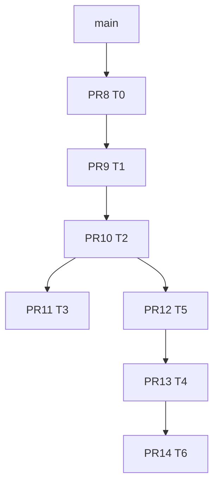

# Startup track reports

Per-PR investigation reports for the T0–T6 startup optimization stack on vault **Obsidian** (~4.4k notes, ~16.7k chunks).

| Track | Report | PR | Branch |
|-------|--------|-----|--------|
| T0 trace-infra | [T0-trace-infra.md](T0-trace-infra.md) | [#8](https://github.com/adrianghnguyen/Obsidian-Seek/pull/8) | `startup/trace-infra` |
| T1 greedy-hydrate | [T1-greedy-hydrate.md](T1-greedy-hydrate.md) | [#9](https://github.com/adrianghnguyen/Obsidian-Seek/pull/9) | `path/greedy-hydrate` |
| T2 cheap-yield | [T2-cheap-yield.md](T2-cheap-yield.md) | [#10](https://github.com/adrianghnguyen/Obsidian-Seek/pull/10) | `path/cheap-yield` |
| T3 batch-rpc | [T3-batch-rpc.md](T3-batch-rpc.md) | [#11](https://github.com/adrianghnguyen/Obsidian-Seek/pull/11) | `path/batch-rpc` |
| T5 burst-cap | [T5-burst-cap.md](T5-burst-cap.md) | [#12](https://github.com/adrianghnguyen/Obsidian-Seek/pull/12) | `path/burst-cap` |
| T4 persist-cache | [T4-persist-cache.md](T4-persist-cache.md) | [#13](https://github.com/adrianghnguyen/Obsidian-Seek/pull/13) | `path/persist-cache` |
| T6 compose | [T6-compose.md](T6-compose.md) | [#14](https://github.com/adrianghnguyen/Obsidian-Seek/pull/14) | `path/compose-integration` |

## Report structure

Each report contains:

1. Executive summary  
2. Why the bottleneck existed  
3. What we diagnosed  
4. How we solved it  
4.1 Measurements / evidence  

## Related docs

- Living scoreboard: `.cursor/startup-path-results.md` (on `path/compose-integration`)
- Hypothesis report: `.cursor/startup-hypothesis-report.md`
- Handoff JSON: `.cursor/handoff/T0.json` … `T6.json`

## Merge order

**Result:** 7/8 goals pass on vault; `G_catchup_chunk` partial (no baseline A/B on 4k fixture).
